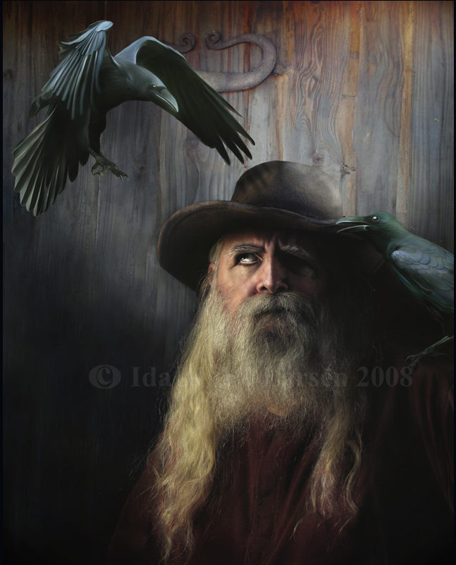

# Aldran

Aldran un grand gaillard grisonnant, facilement reconnaissable à la cicatrice qui barre son orbite vide et au corbeau qui l'accompagne. Même si cela fait plusieurs années qu'il vit au Gabriel, il est en réalité natif des terres lointaines du nord. 

Il a une lance dont il se sert plus comme bâton de marche que comme arme — vivre dans les terres plus civilisées de l'empire font que les combats à l'arme blanche ont plus souvent lieu dans les souvenirs de jeunesse qu'il raconte.

  

**Nom:** Jarre  **Prénom:** Aldran 	**Titre:**   
**Classe:** Illusionniste  
**Niveau:** 3 XP actuels: 0  
XP pour niveau suivant: 150  
Points de Formation(Restants): 700(0)

Âge: Genre:	Orientation sexuelle:  
Race: Ethnie: Natura :	Gnose:  
Langue maternelle: Latin	Autres:  	
Religion d'origine:	Pratiquée:  
Cheveux, yeux, peau:  
Taille, Poids:

Apparence: 10 Taille: 

Méthode de tirage des caractéristiques: 55 points à répartir (-1 à cause de la Sheele)  
Tirage de base des caractéristiques: AGI: 6 CON: 6 DEX: 8 FOR: 8 INT: 9 PER: 4 POU: 9 VOL: 5   
**AGI:** 6  **CON:** 6  **DEX:** 8  **FOR:** 8  **INT:** 10  **PER:** 4  **POU:** 8  **VOL:** 5

Fatigue: 9  
Mouvement: 8	M/round: 22  
Actions Actives: 2  
Régénération: 2	Au repos:	Sans repos:	Spécial:

**Avantages et désavantages :**
- Don mystique 2  
- Familier 2  
- Apte dans un champ de compétences (Intellectuelles) 2  
- Réaction lente -2  
- Vulnérabilité au froid -1  
- Borgne -1 (=Myope)  
- Récupération magique rapide 1  

#### Présence : 40  
**RPhy, RMal, RPoi:** 40(Pre)+5(CON) = 45     
**RMys:** 40(Pre)+10(POU)+10(Don) = 60  
**RPsy:** 40(Pre)+(VOL) = 40  

**Initiative :** 20(Base)-(Armure)+5(AGI)+10(DEX)+20(Arme)+5×3(Classe)-50 = 20 

**Points de Vie :** 85(CON)+5×3(Classe)+(Multiplicateurs: PFs)+(Avantage) = 100  
Restants :

***
##### CHAMPS PRINCIPAUX : (490 PFs)
***
## Champ Martial : (25 PFs)

**Compétences** ( Pfs):  
 Attaque: 10    
 Esquive: 5  
 Parade: 10    
 Port d'Armure: 10    

**Capacités spéciales/Modules d'Armes :** (0 PFs)  
- Mains nues (0pf)

**Ki et accumulations :** (0 Pfs)  
Accumulations 		Points de Ki

| |  Base | Achetés | Base | Achetés | 
| --- | --- | --- | --- | --- | 
| FOR | 1 |  | 8 | | 
| AGI | 1 |  | 6 |  | 
| DEX | 1 |  | 8 |  | 
| CON | 1 |  | 6 |  | 
| VOL | 1 |  | 5 |  | 
| POU | 1 |  | 8 |  |  
|Total |  | 6 | 41 |  | 

Ki restant : 

### Arts Martiaux : (25 PFs)

- **Nom :Tai Chi** Niveau : Expert   
    Avantages :  
    DI octroyé : 30   
    Module d'armes associé :  
    Bonus à l'attaque : Bonus à la défense :  
    Dégâts : 20+2×POU CON

**Développement intérieur total:** 20×3(Classe)+30(ArtsMartiaux)+(MaîtreMartial)+( PFs)= 90  
Utilisé: 40  
Rang d'apprentissage: 1   
Pouvoirs de puissance intérieure : ( DI) 

**Utilisation du Ki** ✅ ( DI) : 
- Contrôle du Ki (30):  
    - Détection du Ki (20):
        - Appréciation du Ki (10):
- Annulation du Poids (10):
    - Lévitation (20):
        - Déplacement d'objets (10):
            - Déplacement des masses (20): (1Ki/50kg/rd)
        - Vol (20): (1Ki/Mvmt, 1/min)
-✅ Extrusion du Ki (10):
    - Armure d'Énergie (10):
       - Armure d'Énergie Majeure (10):
            - Armure d'Énergie Arcane (10):
    - Extension de l'Aura à l'Arme (10):
        - Vitesse accrue (10):
    - Destruction par le Ki (20):
    -✅ Absorption d'énergie (30):
    - Bouclier Physique (10):
- Transmission du Ki (10):
    - Guérison par le Ki (10): (2PV/Ki, max la moitié des PV perdus)
        - Guérison supérieure (10): (5PV/Ki)
        - Stabilisation (10):
- Sacrifice vital (10):
-✅ Utilisation de l'Énergie Nécessaire (10):
    - Dissimulation du Ki (10):
        - Aura de Dissimulation (10):
        - Fausse Mort (10):
    - Élimination des Besoins (10):
        - Immunité élémentaire : Feu (20) :
        - Immunité élémentaire : Froid (20) :
        - Immunité élémentaire : Électricité (20) :
        - Élimination des Malus (20):
    - Récupération (20):
        - Récupération d'autrui (10):
- Maîtrise physique (10):
    - Changement physique (30): (10Ki, 1/min)
        - Changement supérieur (20): (20Ki, 2/min)
    - Contrôle de l'âge (20):
- Surhumanité (30):
    - Zen (50):

***
## Champ Mystique: (465 PFs)

**Zéon** 110(POU)+75×3(Classe)+875(175 PFs)= 1210	   
Restant -20

**AMR** 10(POU)×(1+ (Multiplicateurs)) = 10	   
Régénération zéonique: 10(POU)×(1+(Multiplicateurs AMR)+7(Multiplicateurs de Régénération))+10)×2(Avantage)= 180/j=  
Restant : 90/j

**Projection magique :** (Base)+(Dex)=	Déséquilibre:

Niveaux de magies totaux: 50(Base)+80(80 PFs)+(Avantage) = 130	Restants: 1

Avantages métamagiques : (25 Niveaux de voie)  
- Projection prédéterminée ×2  
- Régénération zéonique améliorée (120/140 pour 10/20 Zéons)  
- Effets persistants  
- Exploitation de l'énergie physique (+25AMR)  

Note : le malus de -50 s’applique à la projection offensive   

| Voies | | | |
| --- | --- | --- | ---- |
| Lumière |  | Obscurité | |
| Création | 60 | Destruction | |
| Eau | | Feu | |
| Air | 26 (Songes) | Terre | |
| Essence | | Illusion | |
| Nécromancie | | | |

**Sorts d'accès libre:** 
| Origine | Niveau | Nom |
| --- | --- | --- |
| Air 8 | 1-10 | Nettoyage | 
| Air 18 | 10-20 | Passage sans Trace | 
| Création 4 | 1-10 | Message statique (« besoin d’aide, suivez-moi » sur le ruban à la patte du corbeau) |
| Création 14 | 10-20 | Poche infinie | 
| Création 24 | 20-30 | Compréhension des langues | 
| Création 34 | 30-40 | Résistance à la douleur  | 
| Création 44 | 40-50 | Absorber les informations | 
| Création 54 | 50-60 | Monture magique | 

**Sorts indépendants:**
- Perfection (18)

**Sorts maintenus : 90/jour**
-65 à l'évaluation magique pour cacher
| Maintien | Voie | Nom | Niveau | Effet |
| --- | --- | --- | --- | --- |
| 25 | — | Sheele |  | 5×(Niveau+2) | 
|  | Air 6 | Mouvoir |  |  | 
|  | Air 10 | Réduire le poids |  |  | 
| 10 | Air 12 | Sans respirer | II |  | 
|  | Création 10 | Régénération |  |  | 
|  | Création 16 | Augmenter les Résistances |  |  | 
|  | Création 22 | Invulnérabilité |  |  | 
|  | Création 26 | Créer Homoncule |  |  | 
|  | Création 28 | Changement Mineur |  |  | 
|  | Création 30 | Immunité |  |  | 
|  | Création 38 | Contrôle Physique |  |  | 
| 20 | Création 60 | Bouclier Parfait | II | 250 PV |
|  | Accès libre 10-20 | Passage sans Trace |  |  | 
| 10 | Accès libre 10-20 | Poche infinie | III | ×40 | 
|  | Accès libre 20-30 | Compréhension des Langues |  |  | 
| 10 | Accès libre 30-40 | Résistance à la douleur | II |  | 
|  | Accès libre 50-60 | Monture magique |  |  | 
| 15 | Noblesse 84 | Perfection | I |  | 

Sheele de Nature - Gontran
For 4, Dex 6, Agi 7, Con 3, Int 9, Pou 8, Vol 6, Per 8
PV: 60 -18
Initiative: 
Projection magique: 60
Style 20, Persuasion 20, Poisons 80, Vigilance 70, Pistage 30, Observation 60, Animaux 40, Herboristerie 80, Médecine 20, Évaluation magique 110, Discrétion 30
[Corbeau: Discrétion 50, Observation 50, Pistage 65, Vigilance 70, Vision nocturne, Vol naturel 10]
Niveaux de Voie : Essence 20 (Sous-voie Paix. Accès libre Ouverture, Brouillard)
Pouvoirs :
- Vol mystique 6
- Régen. 5 PV/rd  
Améliorations :
- Forme naturelle (20 Zéons)
- Scission spatiale du lien
- Sentiments liés 
- Lien de vie
- Forme de l’Âme (150 Zéons, 40/round)  

 
***

## Champ Psychique: (0 PFs)

PPPs: 1(Classe)

***

#### CHAMPS SECONDAIRES: (310 PFs)

[2]Champ clandestin(20 Pfs)
-Camouflage: 5(Base)-5(Per)+10*3(Classe)+ = 30
-Crochetage: (Base)+10(Dex)+ =
-Déguisement: (Base)+10(Dex)+5*3(Classe)+ =
-Discrétion: 5(Base)+5(Agi)+10*3(Classe)+ = 40
-Larcin: (Base)+10(Dex)+5*3(Classe)+ = -5
-Pièges: (Base)-5(Per)+ =
-*Poisons: (Base)+15(Int)+ =

[2]Champ Créatif:(90 Pfs)
-Art: (Base)+10(Pou)+ =
-*Danse: (Base)+5(Agi)+ =
-*Forge: (Base)+10(Dex)+ =
-[1]Habileté Manuelle: 90(Base)+4*10(Dex)+10*3(Classe)+30(BN) = 190
-*Musique: (Base)+10(Pou)+ =
-*Fabrication de marionnettes: (Base)+(Pou)+ =
-*Calligraphie rituelle: (Base)+10(Dex)+ =
-*Alchimie
-*Animisme
-*Runes
-*Orfèvrerie
-*Confection
-*Tatouage
-*Pilotage: (Base)+(Agi sans doute, maybe Dex)+ =

[2]**Champ Athlétique:**(10 Pfs)    
-Acrobaties: (Base)+5(Agi)+ =  
-Athlétisme: 5(Base)+5(Agi)+30(BN) = 40  
-Équitation: (Base)+5(Agi)+ =  
-Escalade: (Base)+5(Agi)+ =  
-Natation: (Base)+5(Agi)+ =  
-Saut: (Base)+(For)+ =  
*Pilotage*: (Base)+(Agi)+ =  

[2] **Champ Vital:** (15 Pfs)  
-Impassibilité: (Base)+0(Vol)+ =  
-Prouesses de Force: 5(Base)+10(For)+30(BN) = 45  
-Résistance à la douleur: (Base)+0(Vol)+100(Sort) = 70 

[2] **Champ Sensoriel:** (0 Pfs)  
-Observation: (Base)-5(Per)-50(Borgne) = -85  
-Pistage: (Base)-5(Per)+ =  
-Vigilance: (Base)-5(Per)-50(Borgne) = -85  

[1] **Champ Intellectuel:** (145 Pfs)  
-*Animaux*: 5(Base)+15(Int)+ = 20  
-*Estimation*: (Base)+15(Int)+ =  
-*Évaluation Magique*: 20(Base)+10(Pou)+5×3(Classe)+30(BN) = 75  
-*Herboristerie*: 5(Base)+15(Int)+ = 20  
-*Histoire*: 50(Base)+2×15(Int)+ = 80  
-*Loi*: (Base)+15(Int)+ =  
-*Médecine*: (Base)+15(Int)+ =  
-Mémorisation: 10(Base)+15(Int)+ = 25  
-*Navigation*: 5(Base)+15(Int)+ = 20  
-*Occultisme*: 50(Base)+3×15(Int)+ = 95  
-*Science*: (Base)+15(Int)+ =  
-*Tactique*: (Base)+15(Int)+ =  

[2] **Champ Social:** (30 Pfs)  
-Commandement: (Base)+10(Pou)+100(Sort)+ = 80  
-*Commerce*: (Base)+15(Int)+ =  
-Connaissance de la rue: (Base)+15(Int)+ =  
-Étiquette: (Base)+15(Int)+ =  
-Intimidation: 5(Base)+0(Vol)+100(Sort)+30(BN) = 135  
-[1]Persuasion: 10(Base)+10(Int)+5×3(Classe)+100(Sort) = 135  
-Style: 5(Base)+10(Pou)+100(Sort) = 115  

[2] **Champ clandestin:** (20 Pfs)  
-Camouflage: 5(Base)-5(Per)+10*3(Classe)+ = 30  
-Crochetage: (Base)+10(Dex)+ =  
-Déguisement: (Base)+10(Dex)+5*3(Classe)+ =  
-Discrétion: 5(Base)+5(Agi)+10*3(Classe)+ = 40  
-Larcin: (Base)+10(Dex)+5*3(Classe)+ = -5  
-Pièges: (Base)-5(Per)+ =  
-*Poisons*: (Base)+15(Int)+ =  

[2] **Champ Créatif:** (90 Pfs)  
-Art: (Base)+10(Pou)+ =  
-*Danse*: (Base)+5(Agi)+ =  
-*Forge*: (Base)+10(Dex)+ =  
-[1]Habileté Manuelle: 90(Base)+4×10(Dex)+10×3(Classe)+30(BN) = 190  
-*Musique*: (Base)+10(Pou)+ =  
*Fabrication de marionnettes*: (Base)+(Pou)+ =  
*Calligraphie rituelle*: (Base)+(Dex)+ =  
*Alchimie*  
*Animisme*  
*Runes*  
*Orfèvrerie*  
*Confection*  
*Tatouage*

***

## ÉQUIPEMENT

### Armes:	

Nom: Arc court	 Qualité: +10

 Attaque:	Parade:	Base de dégâts: Mod. Force:	Dégâts:	Spécial:  
 Vitesse: +0	Solidité:	Fracassement:	Présence:	Mode1:	Mode2:  
 Portée efficace 40(Base) + 20(FOR) = 60 m → Portée maximale 120m (-30 à l'Attaque)  
Flèche : 40

### Armures :

Nom: Cuir Bouilli	 Qualité: +0

 Solidité:	Présence:	Type:	Port Requis:	Localisation:  
 Ips: 2 sauf Énergie 0	

TRA:	-CON:	-PER:	-CHA:	-ELE:	-FRO:	-ENE:

### Autres :
 
Poche infinie (×40) contenant 
– Un chapeau et une paire d'habits de rechange
– Un manteau épais en cas de mauvais temps
– Des petites raquettes à neige, une écharpe, des gants et des bottes d'hiver (on ne sait jamais quand il peut faire FROID)

– deux couvertures
– une petite tente
– des biscuits et de la viande séchée (suffisamment pour tenir quelques jours)
– un grande outre d'eau et une petite de vin
– un briquet à amadou, des brindilles et plusieurs bûches (de quoi allumer un feu, même s'il n'y a pas de bois à proximité) bien sèches
– une casserole et des herbes aromatiques
– un petit poignard (qui sert de couteau et de rasoir) et une pierre à aiguiser
– un petit miroir, du savon, un peigne

– une lampe à huile (avec une petite fiole d'huile)
– une corde de 15m
– une petite statuette en ivoire de morse taillée en forme de corbeau
– une bourse avec la majorité de son argent (il a une bourse plus chichemement garnie à la ceinture)

– Une petite écritoire (crayons et encre, une liasse de feuilles de papier contenant des note sur les lieux qu'il a visité et les légendes locales)

Pr. Zénon : un peu intéressé par la gloire. Insectes, et préparations obtenues à part d'eux

Pr. Nok : intéressé par la faune sauvage (surtout celle venimeuse) ; ne connait pas trop celle du nord qui l'intéresse beaucoup. Vient du Salazar

Pr. Sterker : Géorgraphie, géologie. Met à jour ses cartes et confirme des théories. A hâte d'attaquer les montagnes 

Viktor : jeune, un peu froid. Observateur et réservé. Faible aura magique. Vient du Galgados (famille vit du commerce d'armes à Hécate)

Jeff : avenant, issu d'une famile de l'Empire. Sa famille possède des terres giboyeuses et fait commerce des produits de la chasse

Rose Chansonnet : vient du Gabriel (LaRoche), sa famille exploite des mines — ce sont des orfèvres

Akumi : Curieuse, veut explorer avant de revenir sur Varja

Donatio : s'assure que tout roule pour la caravane et surtout pour le professeur Zénon

Sorin : vraiment pas causant

Quelques rivalités entre les étudiants (c'est ma matière la meilleure, Prof bidule il roxxe plus, etc).

(Elena = alias de Lyssandra)
 
### Ressources

Or:	Argent:	Cuivre: 

***

### Élan :

| Entité | Synchronisation |  |
| --- | --- | --- |
| Mikael |  | | 
| Zemial |  | | 
| Uriel |  | | 
| Jedah |  | | 
| Gabriel |  | | 
| Noah |  | | 
| Raphael |  | | 
| Erebus |  | | 
| Azrael |  | | 
| Abbadon |  | | 
| Barakiel |  | | 
| Eriol |  | | 
| Edamiel |  | | 
| Mesguis |  | | 

### Autres :

**Réputation totale :**
- Audace:
- Lâcheté:
- Honorabilité:
- Infamie:
- Habileté:

**Santé mentale :**
- Seuil de folie:	
- Psychose ou traumatisme:

**Pacte du Dragon :**
 Nom du Dragon:	Sacrifice du Pacte:

**Points de Destin :** 

***

## DIVERS : 
