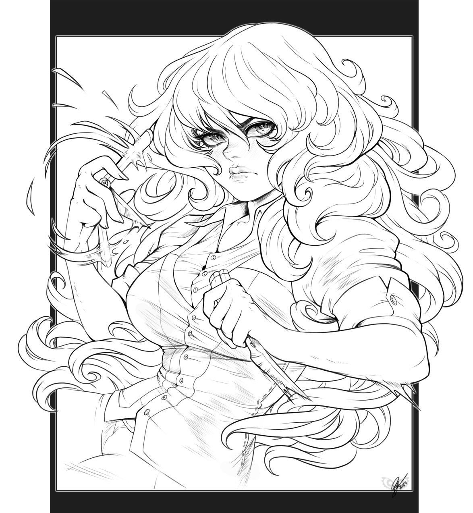

# Anya
Anya a eu une brève carrière de coiffeuse, jusqu'au jour où une cliente s'est plainte que sa coupe la défigurait. Anya l'a prise au mot.  
Désormais recherchée au Dalaborn, elle est allée se mettre au vert dans une vallée perdue du Galados

  

**Nom:** Klosterfeld  **Prénom:** Anya 	**Titre:**   
**Classe:** Mentaliste  
**Niveau:** 2 XP actuels: 128    
XP pour niveau suivant: 225  
Points de Formation(Restants): 0

Âge: Genre:	Orientation sexuelle:  
Race: Ethnie: Natura :	Gnose:  
Langue maternelle: Latin	  	
Religion d'origine:	Pratiquée:  
Cheveux, yeux, peau:  
Taille, Poids: 1m60

Apparence: Taille: 11

Méthode de tirage des caractéristiques: 56 points à répartir 
Tirage de base des caractéristiques: AGI: 8 CON: 8 DEX: 8 FOR: 4 INT: 4 PER: 5 POU: 8 VOL: 10   
**AGI:** 8  **CON:** 8  **DEX:** 8  **FOR:** 4  **INT:** 4  **PER:** 8  **POU:** 5  **VOL:** 11

Fatigue: 8  
Mouvement: 8	M/round: 22  
Actions Actives: 2  
Régénération: 2	Au repos:	Sans repos:	Spécial:

**Avantages et désavantages :**
- Accès à toutes les disciplines psychiques 2
- Préférence psychique (Énergie) 2
- Consommation psychique -2
- Phobie des rats (souris & co) -1
- Maladroit -1
- Homme à tout faire 2
- Apte (Discrétion) 1

#### Présence : 35
**RPhy, RMal, RPoi:** (Pre)+(CON) = 45   
**RMys:** (Pre)+(POU) = 35  
**RPsy:** (Pre)+(VOL) = 55  

**Initiative :** 20(Base)-(Armure)+10(AGI)+10(DEX)+20(Arme)+5×2(Classe)+ = 65   

**Points de Vie :** 110(CON)+5×2(Classe)+(Multiplicateurs: PFs)+(Avantage) = 120     
Restants :

***
##### CHAMPS PRINCIPAUX : (420 PFs)
***
## Champ Martial : (0 PFs)

 Attaque: 10  
 Esquive: 10   
 Parade: 10   
 Port d'Armure: -5  

Ki : 45/45  
Accumulation totale : 7  

**Développement intérieur total:** 10×2(Classe)+(ArtsMartiaux)+(MaîtreMartial)+( PFs)= 20  
Utilisé: 0  

***
## Champ Mystique: (0 PFs)
 
***

## Champ Psychique: (420 PFs)

PPPs: 2(Classe)+25 = 27	 
Libres : 10	

Talent psychique : 70(Vol)+30(6 PPPs)+(Divers) = 100

Projection psychique :100(Base)+10(Dex) = 110  

Patrons psychiques :  
– **Psychopathie** (30pfs)  
    +20 Projection/+30 Talent pour blesser ou influencer quelqu'un à son détriment  
    -80 Talent pour se connecter à l'esprit de quelqu'un  
    -20 Talent pour le reste  
    -100 actions sociales  
– **Courage** (40pfs)  
    +30 Projection/+1 niveau pour les pouvoirs offensifs  
    -20 Projection défensive
    -40 pour échapper à un combat

Attaches psychiques: 2

Disciplines ouvertes:  
– *Énergie*  
– Télékinésie  
– Télépathie  

Pouvoirs:  
– Bouclier d'énergie PV : 42/300 
– Décharge d'énergie  
– Télékinésie mineure (projection /2)  
– Impact télékinétique

***

#### CHAMPS SECONDAIRES: (280 PFs)
  

[2]**Champ Athlétique:**(0 Pfs)  
Acrobaties: (Base)+10(Agi)+10 = 20  
Athlétisme: (Base)+10(Agi)+10 = 20  
Équitation: (Base)+10(Agi)+10 = 20  
Escalade: (Base)+10(Agi)+10 = 20  
Natation: (Base)+10(Agi)+10 = 20  
Saut: (Base)-5(For)+10 = 5  
*Pilotage*: (Base)+10(Agi)+10 =   

[2] **Champ Vital:** (0 Pfs)  
Impassibilité: (Base)+3×20(Vol)+10 = 70   
Prouesses de Force: (Base)-5(For)+10 = 5   
Résistance à la douleur: (Base)+20(Vol)+10 = 30  

[2] **Champ Sensoriel:** (0 Pfs)  
Observation: (Base)+10(Per)+10 = 20  
Pistage:  (Base)+10(Per)+10 = 20  
Vigilance: (Base)+10(Per)+10+20(BN) = 40  

[2] **Champ Intellectuel:** (100 Pfs)  
*Estimation*: (Base)-5(Int)+10 = 5  
*Histoire*: (Base)-5(Int)+10 = 5  
*Loi*: (Base)-5(Int)+10 = 5  
*Médecine*: (Base)-5(Int)+10 = 5  
Mémorisation: 5(Base)-5(Int)+10 = 10  
*Navigation*: (Base)-5(Int)+10 = 5  
*Occultisme*: 45(Base)-5(Int)+10+20(BN) = 70  

[2] **Champ Social:** (0 Pfs)  
Commandement: (Base)+0(Pou)+10-100 = -90  
Étiquette: (Base)-5(Int)+10-100 = -95  
Intimidation: (Base)+20(Vol)+10-100 = -70  
Persuasion: (Base)-5(Int)+10-100 = -95  
Style: (Base)+0(Pou)+10-100 = -90  

[2] **Champ clandestin:** (180 Pfs)  
Camouflage: (Base)+10(Per)+10 = 20  
Crochetage: (Base)+10(Dex)+10 = 20  
Déguisement: 40(Base)+3×10(Dex)+10+20(BN) = 100  
Discrétion: 100(Base)+10(Agi)+10+20(BN) = 140  
Larcin: (Base)+10(Dex)+10 = 20  
Pièges: (Base)+10(Dex)+10 = 20  

[2] **Champ Créatif:** (0 Pfs)  
Art: (Base)+0(Pou)+10 = 10  
*Danse*: (Base)+10(Agi)+10 =   
*Forge*: (Base)+10(Dex)+10 =  
Habileté Manuelle: (Base)+10(Dex)-50 = -40    
*Musique*: (Base)+(Pou)+10 =   

***

## ÉQUIPEMENT

### Autres :
 

### Ressources

Or:	Argent:	Cuivre: 

***

### Élan :

| Entité | Synchronisation |  |
| --- | --- | --- |
| Mikael |  | | 
| Zemial |  | | 
| Uriel |  | | 
| Jedah |  | | 
| Gabriel |  | | 
| Noah |  | | 
| Raphael |  | | 
| Erebus |  | | 
| Azrael |  | | 
| Abbadon |  | | 
| Barakiel |  | | 
| Eriol |  | | 
| Edamiel |  | | 
| Mesguis |  | | 

### Autres :

**Réputation totale :**
- Audace:
- Lâcheté:
- Honorabilité:
- Infamie:
- Habileté:

**Santé mentale :**
- Seuil de folie:	
- Psychose ou traumatisme:

**Pacte du Dragon :**
 Nom du Dragon:	Sacrifice du Pacte:

**Points de Destin :** 

***

## DIVERS : 

Maire (Greta)

Fumée rouge au-dessus de l'ancienne forteresse de TR

Astrid a perdu ses potes (papa, maman, sœur) (ce sont tous des voleurs ! bouh)

/r 1d100xa + 70 # Occultisme
/r 1d100xa + 90 # Bouclier
/r 1d100xa + 80 # Dague