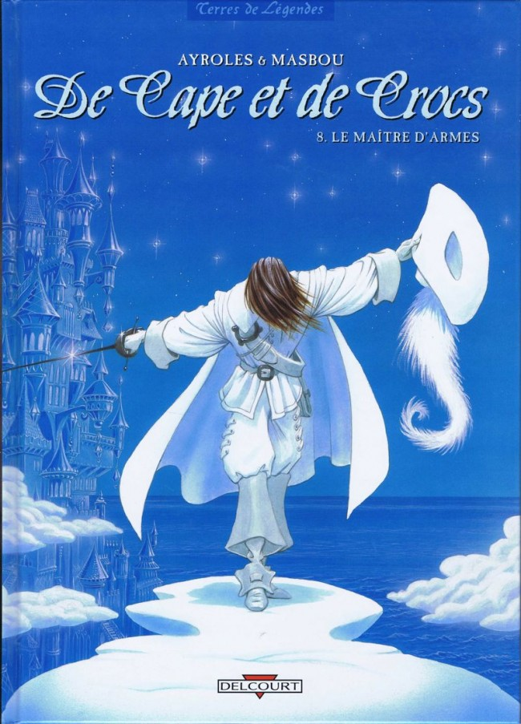

# Gaspard d'Orséac

**Nom:** d'Orséac  **Prénom:** Gaspard 	**Titre:** Chevalier  \
**Classe:** Virtuose martial \
**Niveau:** 4 XP actuels: 375 \
XP pour niveau suivant: 550 \
Points de Formation(Restants): 900 (0)

Âge: Genre:	Orientation sexuelle: \
Race: Humain  Ethnie: Asher  Natura :	Gnose: \
Langue maternelle: Latin 	Autres:  \	
Cheveux blanc, yeux verts \
Taille, Poids:  

Apparence:  Taille: 12

Méthode de tirage des caractéristiques: 55 points à répartir  \
Tirage de base des caractéristiques: AGI: 8 CON: 8 DEX: 10 FOR: 4 INT: 5 PER: 8 POU: 5 VOL: 6  \
**AGI:** 8  **CON:** 8  **DEX:** 13  **FOR:** 4  **INT:** 5  **PER:** 8  **POU:** 5  **VOL:** 6

Fatigue: 8/8 \
Mouvement: 8	M/round: 22 \
Actions Actives: 4 \
Régénération: 2	Au repos:	Sans repos:	Spécial:

**Avantages et désavantages :**
- Racines culturelles (Gabriel) 0
- Rajouter un point à une caractéristique (DEX) 1 
- Adroit 1 
- Maître martial 1 
- Sens aiguisés 1
- Apte (Style) 1
- Artefact 1 (« Sylphide » → Maurevers)
- Arme exclusive -1 (Maurevers)
- Code de conduite (Ordre de Justine : Honneur, courage, égalité) -1
- Vulnérabilité à la magie -1

#### Présence : 45
**RPhy :** 45(Pre)+10(CON) = 55 \
**RMal, RPoi:** 45(Pre)+10(CON) = 55  \
**RMys:** 45(Pre)+0(POU)÷2 = 20 \
**RPsy:** 45(Pre)+5(VOL) = 50 

**Initiative :** 20(Base)+25(Avantage)-(Armure)+10(AGI)+25(DEX)+20(Mains nues)+5×4(Classe)+ = 120 mains nues, 135 Maurevers

**Points de Vie :** 110(CON)+5×4(Classe)+(Multiplicateurs: PFs)+(Avantage) = 130  \
Restants : 130

***
##### CHAMPS PRINCIPAUX : (540 PFs)
***
## Champ Martial : (540 PFs)

**Compétences** (400 Pfs): \
 Attaque: 115(Base)+25(Dex)+5×4(Classe)= 160  \
 Esquive: (Base)+10(Agi)+×(Classe)=  \
 Parade: 85(Base)+25(Dex)= 110  \
 Port d'Armure: (Base)+(For)= -5   \

**Capacités spéciales/Modules d'Armes :** (0 PFs) \
- Rapière (0pf)

**Ki et accumulations :** (140 Pfs) \
Accumulations 		Points de Ki

| |  Base | Achetés | Base | Achetés | 
| --- | --- | --- | --- | --- | 
| FOR | 1 |  | 4 | | 
| AGI | 1 |  | 8 |  | 
| DEX | 3 | 6 | 16 |  | 
| CON | 1 |  | 8 |  | 
| VOL | 1 |  | 6 |  | 
| POU | 1 |  | 8 | 65 |  
|Total |  | 22 | (42) | 106 | 

Ki restant : 5

### Techniques : (45 DI)

- **Nom : Botte secrète** Niveau : 1 \
    Effet : Attaque +40, Manœuvres de combat et attaques visées (-50) \
    DI : 20   Ki : 9 DEX

- **Nom : Le passe-muraille** Niveau : 1 \
    Effet : Intangibilité (Toucher les autres, présence simple), Maintenue  \
    DI : 25	  Ki: 6(3) POU  

### Arts Martiaux : (0 PFs)

**Développement intérieur total:** 50×4(Classe)+40(Maître Martial)+( PFs)= 240 \
Utilisé: 195 \
Rang d'apprentissage: 3 \
Pouvoirs de puissance intérieure : (150 DI) 

**Utilisation du Ki** (40 DI) : [X]
- Contrôle du Ki (30): [X]
    - Détection du Ki (20):
        - Appréciation du Ki (10):
- Annulation du Poids (10): [X]
    - Lévitation (20):
        - Déplacement d'objets (10):
            - Déplacement des masses (20): (1Ki/50kg/rd)
        - Vol (20): (1Ki/Mvmt, 1/min)
- Extrusion du Ki (10): [X]
    - Extension de l'Aura à l'Arme (10): [X]
        - Vitesse accrue (10):
    - Absorption d'énergie (30): [X]
    - Destruction par le Ki (20): [X] RMys vs Présence (+5/ki, max x2), détruit si 
- Transmission du Ki (10):
    - Guérison par le Ki (10): (2PV/Ki, max la moitié des PV perdus)
        - Guérison supérieure (10): (5PV/Ki)
- Sacrifice vital (10):
- Utilisation de l'Énergie Nécessaire (10):
    - Dissimulation du Ki (10):
        - Aura de Dissimulation (10):
        - Fausse Mort (10):
    - Élimination des Besoins (10):
    - Récupération (20):

***
## Champ Mystique: (0 PFs)

**Zéon** 70(POU)

## Champ Psychique: (0 PFs)

***

#### CHAMPS SECONDAIRES: (360 PFs)

[2] **Champ Athlétique:**(30 Pfs) \
Acrobaties: (Base)+10(Agi)+ = \
Athlétisme: 10(Base)+10(Agi)+20(BN)+ = 40 \
Équitation: 5(Base)+10(Agi)+10(RC) = 25  \
Escalade: (Base)+10(Agi)+ = \
Natation: (Base)+10(Agi)+ =  \
Saut: (Base)-5(For)+ = \

[2] **Champ Vital:** ( Pfs) \
Impassibilité: (Base)+5(Vol)+ =   \
Prouesses de Force: (Base)-5(For)+ = \
Résistance à la douleur: 0(Base)+5(Vol)+ =  \

[2] **Champ Sensoriel:** (40 Pfs) \
Observation: 10(Base)+10(Per)+30(BN)+50(Avantage) = 90 \
Pistage:  (Base)+10(Per)+=  \
Vigilance: 10(Base)+5×10(Per)+50(BN)+50(Avantage) = 160

[3] **Champ Intellectuel:** (30 Pfs) \ 
*Histoire*: 5(Base)+0(Int)+10(RC)+ = 15  \ 
Mémorisation: 5(Base)+0(Int)+50(BN)+ = 55  \ 
*Occultisme*: (Base)+0(Int) = \ 

[2] **Champ Social:** (200 Pfs) \
Commandement: (Base)+0(Pou)+10(RC)+ =  \
Étiquette: 10(Base)+0(Int)+50(BN) = 60 \
Intimidation: (Base)-5(Vol)+ = \
Persuasion: (Base)+0(Int)+10(RC)+= \
[1]Style: 180(Base)+0(Pou)+20(RC) = 200

[2] **Champ clandestin:** (20 Pfs) \
Camouflage: (Base)+10(Per)+ =  \
Crochetage: (Base)+25(Dex)+ = \
Déguisement: (Base)+25(Dex)+ = \
Discrétion: (Base)+10(Agi)+=   \
Larcin: 10(Base)+4×25(Dex)+ = 110 \
Pièges: (Base)+25(Dex)+ = \

[2] **Champ Créatif:** (40 Pfs) \
Art: (Base)+0(Pou)+10(RC)= \
*Danse*: 10(Base)+10(Agi)+50(BN)+10(RC) = 80 \
Habileté Manuelle: 10(Base)+2×25(Dex)+30(Avantage) = 90  \

***

## ÉQUIPEMENT

### Armes:

Maurevers est l'épée ancestrale de la famille d'Orséac. C'est une des meilleurs lames de Bellegarde, forgée il y a deux siècle par un forgeron qui réemploya une arme plus ancienne, d'origine sylvaine, reforgée pour l'occasion. La garde ouverte arbore sur un entrelas de métal le martin-pêcheur qui orne les armoiries d'Orséac.

Nom: Maurevers	 (Rapière +10) \
Attaque: 170  Parade: 120  Dégâts: 60(base)-5(For)+10(Ki) = 55 PER (TRA) \
Présence: 120  Solidité 21  Spécial: Vélocité, Précise, l'Aile de l'alcyon

L'Aile de l'Alcyon : \
La botte secrète de la famille d'Orséac. Maurevers fut jadis imbue du pouvoir d'un élémentaire d'air, ce qui lui permet de courber l'espace pendant un court instant afin de porter une estocade mortelle, donnant l'impression que son porteur se déplace pour porter un coup d'une rapidité surnaturelle. Un ennemi qui se s'y attend pas doit tréussir un test de Difficulté Très Difficile ou Absurde pour éviter de souffrir du malus de Surprise ou de la situation appropriée comme par exemple de dos ou de flanc. Ce test n'est requis que la permière ou deuxième fois que quelqu'un se sert de ce déplacement spécial (portée 5m) contre une personne déterminée. Cette manœuvre ne peut être employée qu'une fois tous les 5 rounds.

### Armures :

### Autres :
 -  

### Ressources

Or:	Argent:	Cuivre: 

***

### Élan :

| Entité | Synchronisation | Pouvoirs  |
| --- | --- | --- |
| Mikael |  | | 
| Zemial |  | | 
| Uriel |  | | 
| Jedah |  | | 
| Gabriel |  | | 
| Noah |  | | 
| Raphael |  | | 
| Erebus |  | | 
| Azrael |  | | 
| Abbadon |  | | 
| Barakiel |  | | 
| Eriol |  | | 
| Edamiel |  | | 
| Mesguis |  | | 

**Points de Destin : 1** 

***

# Campagne

## Background

Blason : D'azur à l'alcyon d'argent flottant sur une onde de gueules, qui est d'Orséac

