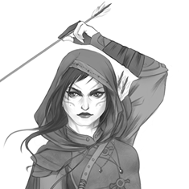

# Isora Volescu

**Nom:** Volescu  **Prénom:** Isora	**Titre:** \
**Classe:** Virtuose martial \
**Niveau:** 7 XP actuels: 975 \
XP pour niveau suivant: 1225

Âge: Sexe: F	Orientation sexuelle: Bastarache \
Race: Humaine  Ethnie: Basan   Natura : 0  Gnose: \
Langue maternelle: Achéron	Autres:  \	
Religion d'origine:	Pratiquée: \
Cheveux, yeux, peau: \
Points de Formation(Restants): \
Taille, Poids: \
Apparence: Taille: 16

Méthode de tirage des caractéristiques: 36 points à répartir (-1 à cause de la Sheele) +16 niveau 1 \
Tirage de base des caractéristiques: AGI: 4 CON: 4 DEX: 5 FOR: 4 INT: 4 PER: 4 POU: 6 VOL: 4  \
**AGI:** 6+2(bottes)  **CON:** 9  **DEX:** 6  **FOR:** 8  **INT:** 4  **PER:** 4  **POU:** 13  **VOL:** 4

Fatigue: 9-4 \
Mouvement: 13	M/round: 80 \
Actions Actives: 2 \
Régénération: 2	Au repos:	Sans repos:	Spécial:

**Avantages et désavantages généraux:** \
Pleine Accumulation 2 \
Techniques déliées 1 \
Familier 2 \
Maître Martial 1 \
Réaction lente -2 \
Vulnérable à la douleur -1 \
Grave allergie (Fer) -1 \
(Niveau 1) Nature magique 1

#### Présence: 60
**RPhy, RMal, RPoi:** 60(Pre)+10(CON)+20(Corps de vide) = 90 \
**RMys:** 60(Pre)+20(POU) +20(Corps de vide)= 100 \
**RPsy:** 60(Pre)-5(VOL)+20(Corps de vide) = 75

**Initiative :** 20(Base)-(Armure)+10(AGI)+5(DEX)+(Arme)+7×5(Classe)-50(Avantage) = + 20

**Points de Vie :** 120(CON)+7×5(Classe)+(Multiplicateurs: PFs)+(Avantage) = 155 \ 
Restants : 155
Sacrifiés : 0
***
##### CHAMPS PRINCIPAUX :
***
## Champ Martial: (720 PFs) 

**Compétences** (300 Pfs): \
 Attaque: 150(Base)+5(Dex)+7×5(Classe)= 190 (200 arc +10) \
 Esquive: (Base)+(Agi)+(Classe)= 10 \
 Parade: (Base)+(Dex)+(Classe)= 5 \
 Port d'Armure: (Base)+(For)= 10  \

**Capacités spéciales/Modules d'Armes:** (0 PFs) \
- Arc court (0pf)

**Ki et accumulations:** (300 Pfs) \
Accumulations 		Points de Ki

| |  Base | Achetés | Base | Achetés | 
| --- | --- | --- | --- | --- | 
| FOR | 1 |  | 8 | | 
| AGI | 1 |  | 6 |  | 
| DEX | 1 | 7 | 6 |  | 
| CON | 1 |  | 9 |  | 
| VOL | 1 |  | 4 |  | 
| POU | 3 | 11 | 16 | 80 |  
|Total |  | 26 | (49) | 167 | 

 Ki : 49(Base) + 120(Achetés) = 169 \
 Restant

### Techniques: (160 DI)

**Nom:** Flèches Éthérées	 Niveau: 1 \
 Un peu comme l'arme de Saber dans Fate/Zero : de l'air condensé, invisible à repérer \
 Effets: Attaque Camouflée (240), Liée à un élément (Air), Maintenue, Combinable \
 DI: 20	Ki: 12(3) POU

**Nom:** Pluie de flèches Niveau: 1 \
Dégâts 2×Présence + POU = 135 ENE \
 Effets: Attaque de zone (25m, choix des cibles), Liée à un élément (Air), Combinable \
 DI: 20	Ki: 9 POU

**Nom:** Hypnose Niveau: 2 \
 Effets: État surnaturel (RPhy 160, Fascination), Liée à un élément (Obscurité), Combinable, Pas de dégâts \
 DI: 40	Ki: 26 POU 2 VOL

**Nom:** Arc Enflammé	 Niveau: 1 \
Effets: Attaque (+50), Maintenue, Liée à un élément (Feu), Combinable \
 DI: 20	Ki: 12(4) DEX 

**Nom:** Le châtiment divin	 Niveau: 3 \
Dégâts 2×Présence + POU = 135 ENE \
 Effets: Attaque (+200), Attaque de zone (100m, choix des cibles), Attaques supplémentaires (+3, Bonus de fatigue partagé, Combo), Réduction d'armure (IP -2), Prédétermination, Sacrifice de vie complet, Malus à toutes les actions (-150)   \
 DI: 60    Ki : POU 42  DEX 24  FOR 3  VOL 2  CON 2 (total 73, 3 rounds)

Tour 1
J'en appelle à vous dieux protecteurs de l'Itzi, 
Voyez votre terre ravagée par l'ennemi
(je vous préviens
la suite ne sera pas alexandrins)
Tour 2 (l'incantation prend des accents désespérés)
L'impur et l'infidèle 
Abattront vos autels !
Écoutez mon appel ;
Montrez par votre zèle
Qu'ils sont aussi mortels !
Tour 3 :
Que le courroux des cieux
Allumé par mes voeux 
Fasse pleuvoir sur eux
UN DÉLUGE DE FEU
(dédicace à Corneille, Horace, Acte IV Scène 5)
(tire une flèche droit en l'air)
Que le regard de Bichu vous consume !
(Le zénith s'éclaircit, le soleil grossit, semble transpercer les cieux. Un énorme rayon en sort, réduisant en cendres toutes ce qu'il juge impur)
...
Que la mâchoire d'Utai vous dévore !
(un immense serpent surgit depuis l'horizon. on ne voit pas encore la fin de son corps que sa tête démesurée se dresse au-dessus de la mêlée, cachant le soleil. Il ouvre grand la gueule et s'abat sur le sol en la refermant. Les dents ne se touchent pas toutes, et certaines personnes sont épargnées)
...
Que l'abondance de Sentéoclxiocatl vous étreigne !
(du sol jaillisent des tiges, et un champ de maïs se met à pousser, dru. les tiges sont très rapprochées, et les épis de maïs qui commencent à pousser dessus sont les plus gros que vous avez jamais vu. Le problème, c'est qu'il y en a tellement que vous l'on ne peut plus bouger. On étouffe presque. Et puis vous entendez les bruits de personnes qui craquent broyées par la végétation)
...
Que la bonté de Pachamama vous caresse !
(dans les cieux apparaît une immense femme. Elle lève la paume puis referme sa main et pointe le doigt vers vous. Le doigt descend. Il commence à rougoyer, ce qui inquiètereait vos personnages s'ils comprenaient qu'il s'agit de la couleur que prend un doigt de plusieurs kilomètres quand son extrémité effectue une rentrée atmosphérique... C'est la déesse Terre, et la Terre est grande. Le doigt se pose délicatement sur vous, vous sentez une douce caresse pendant que le bruit d'un astéroïde heurtant le sol assourdit vos tympans)
...

**Développement intérieur total:** 7×50(Classe)+(ArtsMartiaux)+40(MaîtreMartial)+120(120 PFs)= 510	Utilisé: 520 \
 Rang d'apprentissage:  \
Pouvoirs de puissance intérieure : (150+210 DI) \
**Utilisation du Ki** (40): [X]
- Contrôle du Ki (30): [X]
    - Détection du Ki (20): [X]    520(DI)+10(Vig)÷2 = 265
        - Appréciation du Ki (10): [X]
- Forcer techniques (20):
- Aura de combat (40):
- Maîtrise physique (10):
    - Changement physique (30): (10Ki, 1/min)
        - Changement supérieur (20): (20Ki, 2/min)
    - Multiplication des corps (30):
        - Multiplication des corps majeure (30):
            - Multiplication des corps arcane (40):
        - Magnitude (30):
            - Magnitude arcane (40):
    - Contrôle de l'âge (20):
- Imitation de techniques (50):
- Annulation du Poids (10):
    - Lévitation (20):
        - Déplacement d'objets (10):
            - Déplacement des masses (20): (1Ki/50kg/rd)
        - Vol (20): (1Ki/Mvmt, 1/min)
- Extrusion du Ki (10): [X]
    - Armure d'Énergie (10):
       - Armure d'Énergie Majeure (10):
            - Armure d'Énergie Arcane (10):
    - Extension de l'Aura à l'Arme (10):
        - Attaque élémentaire (10):
        - Dégâts accrus (10):
        - Portée accrue (10):
        - Vitesse accrue (10):
    - Destruction par le Ki (20):
    - Absorption d'énergie (30): [X] 1 ki → 5 dégâts
- Bouclier Physique (10):
- Transmission du Ki (10):
    - Guérison par le Ki (10): (2PV/Ki, max la moitié des PV perdus)
        - Guérison supérieure (10): (5PV/Ki)
    - Stabilisation (10):
- Sacrifice vital (10): [X] 2PV sacrifiés → 1 Ki
- Utilisation de l'Énergie Nécessaire (10):
    - Dissimulation du Ki (10):
        - Aura de Dissimulation (10):
        - Fausse Mort (10):
    - Élimination des Besoins (10):
    - Immunité élémentaire : Feu (20) :
    - Immunité élémentaire : Froid (20) :
    - Immunité élémentaire : Électricité (20) :
    - Élimination des Malus (20):
        - Récupération (20):
            - Récupération d'autrui (10):
- Augmentation des Caractéristiques (20):
    - Accroissement supérieur (20):
- Techniques de combat improvisées (50):
- Surhumanité (30):
    - Zen (50):

**Utilisation du Némésis** (70): [X]       Portée des auras : 50m
- Armure de vide (20):
    - Noht (30):
- Annulation du Ki (20):
    - Annulation majeure du Ki (30):
- Annulation de la magie (20): [X] 2 Ki/ round (5 si 1 une personne) 26 acc → -60 Zéon 
    - Annulation majeure de la magie (30): 5 Ki/ round (10 si 1)
- Annulation des matrices (20): 2 Ki/ round (5 si 1 une personne)
    - Annulation majeure des matrices (30): 5 Ki/ round (10 si 1)
- Annulation des liens (20):
- Extrusion de vide (30): [X]
- Corps de vide (10): [X]
    - Sans besoin (10):
    - Mouvement de vide (20): [X]
    - Forme de vide (30):
        - Essence de vide (20):
        - Un avec le néant (40):
- Aura de vide (30):
- Non-Détection (10):
- Surhumanité (20): [X]
    - Zen (40): [X] -10 DI endetté (Pouvoir difficulté 11, sinon -1 en Fatigue)

***
## Champ Mystique: (190 PFs)

**AMR:** 15 (POU)	 \
 Régénération zéonique: 15(AMR)×(1+5 (Multiplicateurs))= 90	Restant : -50 (Sheele) -5(Poche infinie ×10) = 35/j  \
 Zéon: 175(POU)+7×50(Classe)+25(15 PFs)= 550 \
 Reste :550 \
 Projection magique: (Base)+(Dex)=	Déséquilibre: \

**Sheele :** Liviel \
 PV Présence×4 = 240 (Régénération 5 PV/round) \ 
 Restants : 240

For 4 Dex 6 Agi 7 Con 3 Int 7 Pou 8 Vol 6 Per 8 \
Niveaux de voie : Essence 20 (Nettoyage, Créer musique, Poche infinie, Surhumanité) \
Champs secondaires : 
- Vigilance 40+8×10+40= 160
- Observation 20+8×10+40= 140
- Animaux 40
- Évaluation magique 80+8×10+40= 200
- Herboristerie 80
- Medécine 20
- Persuasion 20+8×10+40 = 200
- Style 20+8×10+40 = 140
- Poisons 80

Pouvoirs :
- Forme naturelle (20 Zéons par changement)
- Projection accrue ×2
- Défenseur → Projection défensive 200
- Bouclier de l'âme (150 Zéons, dure Volonté rounds, Présence×10 PV, Proj+50)
    PV : 600 
- Compétences améliorées
- Sentiments liés (peut voir, entendre et parler via Liviel)
- Endurance améliorée
- Lien de vie

| | Hibou | Chat | Nya leusi | Ilona | Fourmi ouvrière | Fourmi guerrière |
| --- | --- | --- | --- | --- | --- | --- |
| Initiative | 30 | 60 | 100 | 70 | 55 | 85 |
| PV | 70 | 40 | 110 | 875 | 60 | 125 IP2 |
| Attaque | 30 | 20 | 135 | 80 | 70 | 120 |
| Défense | Esq. 5 | Esq. 40  | Esq. 110  | Enc. IP 3 | Esq. 70 | Esq. 125 |
| Dégâts | 10 PER | 10 PER | 50 TRA | 60 CON  | 40 TRA | 90 TRA  |
| Acrobaties |	-  | 30 | 40  | - | - | - |
| Athétisme |	-  | 25 | 50 | 200 | 35 | 45 |
| Escalade | -  | 25 |  -  |  - | 70 | 45 |
| Natation | - |  - |  -  | 15 | - | - |
| Saut | - |  25  | -  | 140 | 75 | 45 |
| Pr. de force | - |  - |  -  | 50 | - | - |
| Observation |	50(20) | 20  | 100(70) | 	- | 25(55) | 15(45) |
| Pistage | 65(35) | 25  | 100(70) | - | - | - |
| Vigilance |	70(40) | 40  | 100(70) | 50 | 30(60) | 30(60) |
| Intimidation |	-  | - |  10  | - | - | - |
| Style | -  | - |  - |  40 | - | - |
| Camouflage |	- |  15  | 80  | - | - | - |
| Discrétion |	50  | 20 |  155  | -  | - | - |
| Sens aiguisé | 	Vue&ouïe | 	- | odorat | - | vision circulaire | vision circulaire |
| Spécial | Vol 10 | Voir le surnaturel | Voir le surnaturel | Lien spirituel avec le cavalier | Dard RPoi 80 | Rpoi 100, Acide Rphy80 25m |
| Rphy, Rpoi, Rmal | 15 | 10 | 45 | 50 | 25 | 25 |
| Rmys | 20 | 20 | 40 | 45 | 20 | 20 |
| Rpsy | 20 | 10 | 40 | 50 | 10 | 10 |

***

## Champ Psychique: (0 PFs)

***

#### CHAMPS SECONDAIRES: (290 PFs)

[2]**Champ Athlétique:**(120 Pfs) \
Acrobaties: (Base)+10(Agi)+2×10 = 0 \
Athlétisme: 5(Base)+10(Agi)+15(RC)+ = 25 \
Équitation: 50(Base)+5×10(Agi)+4*10 = 140 \
Escalade: (Base)+10(Agi)+ = \
Natation: 5(Base)+10(Agi)+ = 15 \
Saut: (Base)+10(For)+ =

[2] **Champ Vital:** (10 Pfs) \
Impassibilité: 5(Base)-5(Vol)+7×10 = 60 \
Prouesses de Force: (Base)+10(For)+ = \
Résistance à la douleur: (Base)-5(Vol)+ = \

[2] **Champ Sensoriel:** (30 Pfs) \
Observation: (Base)-5(Per)+ = \
Pistage:  10(Base)-5(Per)+15(RC)+7×10 = 70 \
Vigilance: 5(Base)-5(Per)+10 = 10

[3] **Champ Intellectuel:** ( Pfs) \
Animaux: (Base)-5(Int)+10(RC)+7×10 = \
Évaluation Magique: (Base)+20(Pou)+ = \
Herboristerie: (Base)-5(Int)+10(RC) = \
Mémorisation: (Base)-5(Int)+ = \

[2] **Champ Social:** (40 Pfs) \
Commandement: 10(Base)+4×25(Pou)+ = 110 \
Étiquette: (Base)-5(Int)+ = \
Intimidation: (Base)-5(Vol)+ = \
Persuasion: (Base)-5(Int)+10(RC)+= \
Style: 10(Base)+4×25(Pou)+10(RC) = 110

[2] **Champ clandestin:** (60 Pfs) \
Camouflage: 10(Base)-5(Per)+15(RC)+7×10 = 70 \
Crochetage: (Base)+5(Dex)+ = \
Déguisement: (Base)+5(Dex)+ = \
Discrétion: 10(Base)+5×10(Agi)+5×10 = 110 \
Larcin: (Base)+5(Dex)+ = \
Pièges: 10(Base)+5(Dex)+15(RC) = 30 \
Poisons: (Base)-5(Int)+ =

[2] **Champ Créatif:** (30 Pfs) \
Art: 5(Base)+2×25(Pou)+ = 55 \
Danse: 5(Base)+10(Agi)+7×10 = 85 \
Forge: 5(Base)+5(Dex)+3×10  = 40 (Flèches 80, autres 0) \
Habileté Manuelle: (Base)+5(Dex)+ =

***

## ÉQUIPEMENT

### Armes:	

Nom: Arc court	 Qualité: +10

 Attaque:	Parade:	Base de dégâts: Mod. Force:	Dégâts:	Spécial: \
 Vitesse: +0	Solidité:	Fracassement:	Présence:	Mode1:	Mode2: \
 Portée efficace 40(Base) + 20(FOR) = 60 m → Portée maximale 120m (-30 à l'Attaque) \
Flèche : 40 \
 Flèche +15 en métal bleuté : 14  avec en kiss cool destruction de zeon contre rmys 140 \
 Flèche légère : 20 +20m portée maximale

Nom: Silfur (PE p)	 Qualité: +10

 Attaque:	Parade:	Base de dégâts: Mod. Force:	Dégâts:	Spécial: \
 Vitesse: +0	Solidité:	Fracassement:	Présence:	Mode1:	Mode2: \
 Portée efficace 40(Base) + 20(FOR) = 60 m → Portée maximale 120m (-30 à l'Attaque) \
Flèche : 40 \
 Flèche +15 en métal bleuté : 14  avec en kiss cool destruction de zeon contre rmys 140 \
 Flèche légère : 20 +20m portée maximale

### Armures :

Nom: Cuir Bouilli	 Qualité: +10

 Solidité:	Présence:	Type:	Port Requis:	Localisation: \
 Ips: 4 sauf Énergie 0	

TRA:	-CON:	-PER:	-CHA:	-ELE:	-FRO:	-ENE:

### Autres :
 3 carquois ( 2×20 Flèches , 1×20 Flèches légères) \
 Stylet +15 en métal bleuté  \
 Bottes AGI+2 \
 couteau  \
 couverture + bâche étanche pour dormir à la belle étoile  \
 savon, miroir  \
 quelques craies  \
 gourde  \ 
 citronelle / herbe à brûler pour repousser les insectes → 1 mois \
 rations 1 mois \
 le tout dans un sac à dos \
 ah, et des bottes étanches \
 si on doit patauger dans des marais \
 ~~(le couteau est un cadeau de mon grand-père Bjorn)~~  (offert en offrande sur le bûcher de Lucia) \
 paquet de graisse pour s'occupper du cuir/corde d'arc \
 (réservé au cordonnier de Vendrill : nacelle à Killgar) \

Or:	Argent:	Cuivre: 
 165

 ### Élan :

| Entité | Synchronisation | Bonus |
| --- | --- | --- |
| Mikael | 7 | | 
| Zemial |  | | 
| Uriel | 7 | | 
| Jedah | 1 | | 
| Gabriel | 4 | | 
| Noah | 7 | | 
| Raphael | 1 | | 
| Erebus | 1 | | 
| Azrael | 2 | | 
| Abbadon |  | | 
| Barakiel | 9 | | 
| Eriol |  | | 
| Edamiel |  | | 
| Mesguis |  | | 

### Points de Destin : 0    

***

DIVERS:

Najim : Bastarache Drechler
 Kalva : Lucia
 JB : Ika Arces
 Yehon : Killgar
Vendrill
 Fête du printemps
Illa Vesbaris =Intendante de la garnison d'z de Vendrill
 Commandant Brega

Ion von Karl : marchand spécialisé dans l'importation de denrées exotiques de l'Itzi
 Adya Ionescu :
Kirgan : siège de la guilde des vivriers, grenier du royaume

Cité de Tepek

Attaque d'hommes hirsutes le premier jour 
Arrivée à l'auberge fortifiée  
 Rencontre avec Lorn Askarian qui admire les épées 
Attaque nocturne surprise 
Ville de Kirgan. Remparts de pierre. Siège de la guilde des vivriers.  
  Chef des forcées armées : général Bogdan Poka (Kopa ?) 
Hammeliga 
 village fortifié. Garnison militaire uniquement 
 tour hexagonale (80m) au milieu  
 Capitaine lrich Maresku (2nd du général Kassil) 
Cité de Tepek 
 beaucoup de cultures de maïs, trouées dans la jungle 
 guttes, chaumières 
 
 
Embuscade par des coureurs des bois (dards empoisonnés !), serviteurs de :
Xamicuitl, fils de "l'Ombre dont les mortels n'ont pas le droit de prononcer le nom", le maître suprême des jungles de l'Itzi
première descendance du Dragon d'Ombre Nezcarramos, premier serviteur de Svalkistalazar 

Domaine de l'Exilé

Hammeliga : 

17/06 : Voyage vers Hammeliga. Diner avec un groupe de sorciers connaissances/admirateurs de Sigma. Rencontre avec un duk'zarist (Dunkar Zaratos  3ème fils de la Maison Zaratos) qui dit que j'ai du potentiel magique et propose de... m'aider à le libérer (?) dans le futur. 
On récupère la nacelle pour Killgar 

23/09 : 
Départ vers le sud-est, vers la grande cité perdue dans la jungle. Arrivée à un village brûlé en ruines. Pyramide (3 étages, mais des souterrains en plus) dédiée à la Messagère.
À l'intérieur, passage dans la Veille où un rituel sombre se trame

01/10 :
Affrontement contre le groméchant (sorcier naga en train de canaliser les âmes des morts), son invocation protectrice (gros truc reptilien à encaissement) et son turak de compagnie (et sa hache de bataille).
Le rituel est interrompu avant son terme ; un portail s'ouvre et une grande griffe draconique récupère l'artefact (dent de dragon ?) qui servait à brûler les âmes des morts. Explosion mystique, cassage de genoux du mage.

07/10 :

12/10 :
4 jours de marche dans le marais depuis le temple de la Messagère. Attaque de la pyramide, protégée par plein de mines de feu, des jayans corrompus et des turaks.

14/10 :
Sortie des Jayans corrompus. Encornage (très, Attaque 528) douloureux. Point de destin mais cicatrice à vie sous la gorge.

Après t'être fait encorner par le monstre, pendant ce bref moment ou ton âme à été hors de ton corps tu t'es retrouvé face à deux  êtres célestes, deux femmes d'une grande beauté et à la Présence écrasante. La première, rousse à la peau pâle et aux yeux d'émeraude, vêtue d'une armure lourde de métal clair ornée de symboles dorés. La seconde, une beauté aux cheveux de Jais et à la peau pâle, te fixe avec ses yeux pâles, elle porte une longue robe de soirée blanche brodée de fils d'argent. Celle en armure s'adresse à toi: << Nous vous avons observés tes compagnons et toi et nous approuvons vos actes! Mais ton âme, elle, nous a ému, et nous souhaitons te donner la chance de retourner finir ce que vous avez commencé.
(Edamiel et Mikael)

21/10 : (absent)
Dispute entre les tribus au sujet de quel dieu tutélaire vénérer
- Bichu vénère le dieu-soleil Ceyacoatl. Grand prête
- Akulma, vénère le serpent de l'eau (dieu ). Chamane Itzel
- Unsek. LEader Ixpil
Ameyal, tribu des Eruzoro, vénère Patchamama déesse mère, fertilité
Guerrier Sage Siaocoatl, tribu des Bichou, vénère le Soleil
Shamane Itzelle, tribu des Aculma, vénère le Serpent de l'eau, vie la pêche et du fleuve, Utai
Xpil, tribu des Inseck, vénère le dieux Maïs, de la nourriture, Sentéoclxioatl

26/10 :
Nezcarramos se fait désormais appeler Citlacoatl (nom d'un démon responsable des éclipses de soleil)
Repas pour calmer les gens
Isora s'occuppe du plan de table avec une mise en scène tip top :)

04/11 :
Descente dans les sous-sols péter la gueule eux bestioles qui montent et péter la gueule à l'Exilée...

12/11 : 
Combat !
Bastarache va prendre le thé
Killgar SMASH
L'étang aux langoustines est compté dans les dégâts collatéraux :(

18/11 :
Silfur absorbe l'énergie magique des profondeurs (+20 AMR, +2 Acc POU/VOL)

Update des stats
/r $att=1d100!>90+200 # update changement de niveau
/r $apprec_ki=1d100!>90+265 # update changement de niveau
/r $init=$DE+20 # tu vas pleurer Bastarache
/r $obs=1d100!>90+140 # update changement de niveau
/r $shield=1d100!>90+250 # update changement de niveau
/r $style=1d100!>90+100
/r $vig=1d100!>90+160 # update changement de niveau
/r $dis=1d100!>90+110 # update changement de niveau

Timeskip :
Tensions à Elciana : le véritable pouvoir est dans les mains des d'k 

Zebah +10 cac

Mercredi 6 janvier
Contactés par Ika à Vendrill, qui a retrouvé la piste de ses origines.

Dans les montagnes de l'ombre (au nord-est, on y va en volant à dos de sheele rejeton ophidien), il y a les restes d'un vaisseau écrasé.

Dedans, des morts (anciens !), uniformes rouges et or (dessins symbolisant... une sorte de grade, de métier ?). Le vaisseau réagit à la présence d'Ika, son artefact a l'air de se réveiller lui aussi. Une source d'énergie dans les tréfonds du vaisseau s'approche de nous. Un grand golem de 2m50 de haut, avec deux paires d'ailes et deux grandes queues effilées, arborant un point scitillant au milieu de son torse.