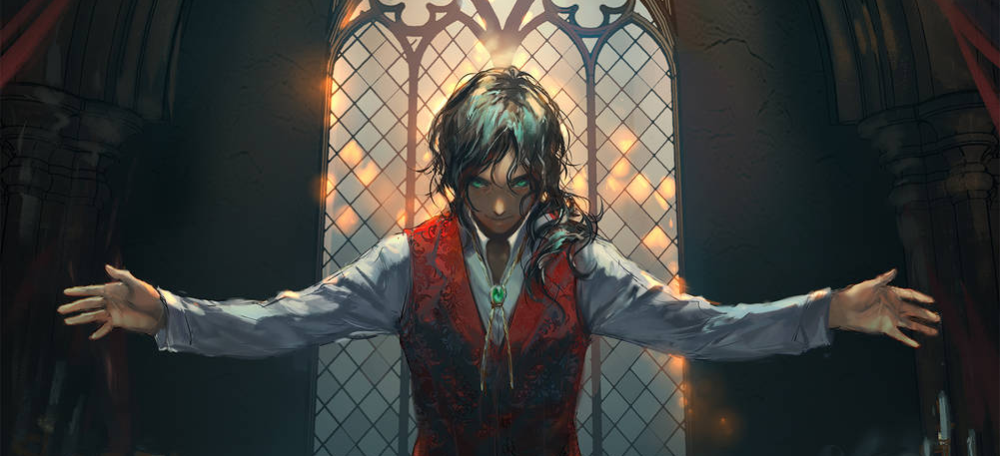

# Adramis d'Harnavaze

  

**Classe :** Sorcier 2 / Barde 2     
**Race :**  Humain (h), CB  
**Historique :** Acolyte  

Tirage de base : 8 14 13 12 10 15  
| | Force | Dextérité | Constitution | Intelligence | Sagesse | Charisme | 
| ---  | --- | --- | --- | --- | --- | --- | 
| Valeur | **8** (-1) | **14** (+2) | **14** (+2) | **12** (+1) | **10** (+0) |  **17** (+3) |
|  |  |   |   |  | ☑ |  ☑ |
|  Sauvegarde | -1 | +2 | +2 | +1 | +2 | +5 |

**Bonus de maîtrise :** +2  

**Compétences :** (Perception passive 10)
| Compétence | Carac | Maitrisée | Total |
| --- | --- | --- | --- | 
| Acrobaties | Dex | +1 | +3 |
| Arcanes | Int | ☑ | +3 |
| Athlétisme | For | +1 | +0 |
| Discrétion | Dex | +1 | +3 |
| Dressage | Sag | +1 | +1 |
| Escamotage | Dex | +1 | +3 |
| Histoire | Int | +1 | +2 |
| Intimidation | Cha | +1 | +4 |
| Intuition | Sag | +1 | +1 |
| Investigation | Int | +1 | +2 |
| Médecine | Sag | +1 | +1 |
| Nature | Int | +1 | +2 |
| Perception | Sag | ☑ | +2 |
| Persuasion | Cha | ☑ | +5 |
| Religion | Int | ☑ | +3 |
| Représentation | Cha | ☑ | +5 |
| Survie | Sag | +1 | +1 |
| Tromperie | Cha | ☑ | +5 |

**Armes :** courantes  
**Armures :** légères  
**Outils :** – 
**Langues :** commun, infernal, +2  

##### [COMBAT]
**PV** 24/24  
**Initiative** +2 ; **Vitesse** 9m
**CA** 12 (sans armure, Dex +2), 14 Cuir clouté 

##### [Dons]

**Broyeur** [Crusher](https://www.aidedd.org/dnd/dons.php?vf=broyeur)
Vous êtes habitué à l'art d'écraser vos ennemis, ce qui vous confère les avantages suivants :
 – Augmentez votre valeur de Force ou de Constitution de 1, jusqu'à un maximum de 20.
 – Une fois par tour, lorsque vous touchez une créature avec une attaque qui inflige des dégâts contondants, vous pouvez la déplacer de 1,50 mètre vers un espace inoccupé, à condition que la cible ne soit pas de plus d'une taille que vous.
 – Si vous réalisez un coup critique qui inflige des dégâts contondants à une créature, vous avez un avantage aux jets d'attaque contre cette créature jusqu'au début de votre prochain tour.

(suivant : **[Télékinésiste](https://www.aidedd.org/dnd/dons.php?vf=telekinesiste)** )

##### [CAPACITÉS ET TRAITS]

Aptitude d'historique : **Abri des croyants**  
Vous êtes un acolyte et imposez donc le respect à ceux qui partagent votre foi. Vous pouvez accomplir les cérémonies religieuses liées à votre déité. Vous et vos compagnons
d'aventure pouvez espérer recevoir des soins gratuits dans les temples, autels et autres endroits dédiés à la divinité que vous vénérez. Cela ne vous dispense par contre pas
de fournir les ingrédients nécessaires au lancement des sorts. Ceux qui partagent votre religion peuvent aussi vous donner (mais seulement à vous) de quoi mener un train
de vie modeste.
Vous pouvez être lié à un temple spécifique dédié à votre déité ou votre panthéon et dans lequel vous avez un logement. Cela peut être le temple dans lequel vous officiez,
si vous êtes resté en bons termes avec ses occupants, ou un temple qui est devenu votre nouvelle maison. Quand vous vous trouvez à proximité de votre temple, vous pouvez
demander l'assistance des prêtres qui s'y trouvent, dans la mesure où l'aide qu'ils vous apportent ne les met pas en danger et que vous soyez en bons termes avec eux.

**Inspiration bardique (d6)**   
Utilisations : 3/3 (Récupération : long repos)
Bonus Action. Cible : quelqu'un capable d'entendre à 18m  
Dé valable 10min, peut s'utiliser après lancer (attaque/carac/sauvegarde) mais avant annonce réussite/échec

**Touche-à-tout**  
Ajoute la moitié du bonus de maîtrise aux compétences non maîtrisées

**Chant reponsant**  
+1D6 pv pour moi et alliés lors de récupérations dans un repos court.

**Réceptacle du Génie**  
Object magique, quand je le touche je peux :  
– une fois par repos long, rentrer dedans pour 2×maîtrise (4) heures. Sortie par action bonus, j'entends ce qui se dit dehors
– une fois par tour, +1 dégâts contandants sur un attaque qui touche
CA du réceptacle : 13 
PV : 3 (immunité poison/psychique) 

**Invocations occultes**  
– Explosion insoutenable (dégâts +CHA)   
– Onde de choc (éloigner de 3m)  

##### [ÉQUIPEMENT]
Poids transportable : 60 kgs  

| Objet | Poids (kg) | 
| --- | --- |  
| Habits courants | 1,5 |
| Habits de cérémonie | 2 ? |
| Armure de cuir | 5 |
| Arbalète légère | 2,5 | 
| Carreaux (20) | 0,75 | 
| Symbole sacré (amulette) | 0,5 | 
| Livre de prières | 2,5 | 
| Bâtons d'encens (5) | 2,5 | 
| Bourse | — | 
| Sac à dos | 2,5 | 
| Traité de conniassances | 2,5 | 
| Bouteille d'encre | 2,5 | 
| Porte-plume | 2,5 | 
| Étui à parchemins | 0,5 |
| 10 feuilles de parchemin | — |
| Dague | 0,5 |
| Petit sac de sable | 2,5 |
| Rations (10) | 10 | 
| Outre | 2,5 | 
| Huile | 0,5 | 
| Billes (sac de 1000) | 1 | 
| **Total** | 42,75 | 

63po 7pa  

Poids des pièces 0,7 kg 

##### [PERSONNAGE]
Taille  ; Âge 33 ans  

Quand je fais de la magie, mes yeux changent. On peut voir une flamme brûler au fond de mes yeux.

Membre d'une branche mineure d'une famille ecclésiastique influente, Adramis se destinait à une carrière religieuse standard qui l'aurait mené vers un confortable poste d'évêque dans une région agréable à vivre. Cependant, il a pris la religion un peu trop au sérieux et s'est retrouvé mêlé à des querelles dogmatiques qui commencent à embarrasser ses coreligionnaires. Désormais il a pour principal objectif de faire accepter ses vues à l'église. 

Ses recherches occultes visant à lever le voile qui sépare notre monde des autres l'ont mené à entrer en communication avec un puissant génie nommé Zahak, avec qui il a passé un pacte. En échange de quelques pouvoirs qui pourraient l'aider dans sa quête, le génie n'a demandé qu'à en apprendre plus sur le monde dans lequel il vit.

Selon moi, quelque chose ne va pas rond dans le cycle des réincarnations (même si il fonctionne toujours)

Divinité :
Rime (non genrée)
Le champion choisi se divinise et devient le nouveau Rime. Cycle de quelques dizaines d'années (20-50)

Triumvirat : (jai 30 ans, ils n'ont pas changé depuis mon enfance)
Lübel Kerdobrum le Grand Inquisiteur (M). Je l'ai déjà vu une fois (mais jamais parlé). Grisonnant, apparrence (la quarantaine ?)
Vela Sheleste, l'Ordonnatrice (F). Donne les grands discours, préside les cérémonies → aussi vue de loin, sublime
Vaughin Mireaubeau, l'Index (M). Jamais vu (un portrait de lui jeune).

Cela fait quelques temps que je suis opposé à la doctrine, mais la bascule du côté de la rébellion est récente. 
Je suis sur la liste des oposants, mais looooin tout en bas  

Les dix grandes familles qui dirigent l'église :  
Kerdobrum  
Sheleste  
Mireaubeau  
Sangfleur  
Hauteville   
Diacre  
Trescent  
Bourgfruité  
Montmorain ← ma famille en est issue. Harnavaze est une petite bourgade à une semaine de marche de la capitale (Harmonie. Très avancée, presque Renaissance, voire steampunk. Style architectural bizarre, mélange de plein de trucs)   
Veeskel. Famille d'orfèvres réputés. Peu nombreux, peu d'influence politique. Statut à part. Originellement, le blason avait aussi un Ouroboros, mais un certain Thursalgan les aurait changées (pour rajouter des pattes) il y a des centaines d'années. Thursalgan a eu une fille (Elessa) et il a créé des bijoux qu'il a appelé du nom de sa fille (les Larmes d'Ellessa).     

Les embèmes : le décagone symbolise les 10 familles, il est plus récent que l'Ouroboros qui symbolise le cycle des réincarnations et le renouveau de la déesse. 
Inquisition : trapèze/podium avec un décagone dessus

Scène 1 : bibliothèque pontificale, je cherche à accéder aux archives à accès restreintes. Je me fais jeter. En sortant, je croise un écclésisatique qui me propose un rdv dans un endroit louche : Merwyn, membre d'une branche mineure de la famille Mireaubeau

Dans un grimoire volé dans les archives, je trouve une allusion à une « éclipse de Rime »

Fuite 

Dans un village, rencontre avec Cassie : je rejoins les rebelles   

Rencontres avec Zahaak :  
De ce qu'il a vu autour de moi, il y a quelque chose d'étrange dans la magie qui m'environne. Et en plus un truc magique dissonnant autour de moi. Les cœurs contiennent un bout de magie dissonnante. FX a réussi a les ouvrir aisément... intéressant 
Divination de Z : « Les yeux ne voient pas le mensonge, même lorsqu'il est devant eux. Et dans ce cas vaut-il mieux voir ou être aveugle ? »

L'ancien passage secret a été fermé. La végétation a repris ses droits. On pourrait y retourner.  
Plus aucune trace des autres conspirateurs arrêtés. Les gens ne se souviennnent pas d'eux

  

#### Grimoire :

[Liste sur AideDD](https://www.aidedd.org/dnd-filters/sorts.php)

**Emplacements de sorts :** 5/5 (Niv1)   
Récupération par repos court : 1 (Niv1)

### Tours de magie 

– ✓ [Décharge occulte](https://www.aidedd.org/dnd/sorts.php?vf=decharge-occulte ) VS   
– ✓ [Main de mage](https://www.aidedd.org/dnd/sorts.php?vf=main-de-mage) VSM  
– ✓ [Moquerie cruelle](https://www.aidedd.org/dnd/sorts.php?vf=moquerie-cruelle) V    
– ✓ [Prestidigitation](https://www.aidedd.org/dnd/sorts.php?vf=prestidigitation) VS  

### Sorts de niveau 1 [préparé]

– [Armure d'Agathys](https://www.aidedd.org/dnd/sorts.php?vf=armure-d-agathys) VSM  
– [Maléfice](https://www.aidedd.org/dnd/sorts.php?vf=malefice) VSM   
– [Mot de guérison](https://www.aidedd.org/dnd/sorts.php?vf=mot-de-guerison) V  
– [Murmures dissonants](https://www.aidedd.org/dnd/sorts.php?vf=murmures-dissonants) V  
– [Communication avec les animaux](https://www.aidedd.org/dnd/sorts.php?vf=communication-avec-les-animaux) VS **R**  
– [Représailles infernales](https://www.aidedd.org/dnd/sorts.php?vf=represailles-infernales) VS (Réaction)  
– [Serviteur invisible](https://www.aidedd.org/dnd/sorts.php?vf=serviteur-invisible) VSM **R**  
– [Sommeil](https://www.aidedd.org/dnd/sorts.php?vf=sommeil) VSM   

_____

Divers :  
https://5e.tools/backgrounds.html#acolyte_phb  
https://rpgbot.net/dnd5/characters/classes/wizard/bladesinging/  
https://tabletopbuilds.com/components/  