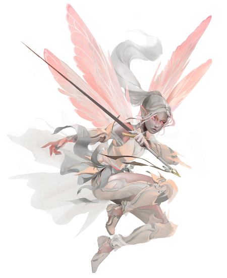

# Delma

  

**Classe :** Magicien 9     
**Race :** [Fée](http://dnd5e.wikidot.com/fairy) (f), CB  
**Historique :** Enfant des rues  

Tirage de base : 15 10 14 7 11 16
| | Force | Dextérité | Constitution | Intelligence | Sagesse | Charisme | 
| ---  | --- | --- | --- | --- | --- | --- | 
| Valeur | **7** (-2) | **18** (+4) | **14** (+2) | **18** (+4) | **11** (+0) |  **10** (+0) |
|  |  |   |   | ☑ | ☑ |   |
|  Sauvegarde | -2 | +4 | +2 | +8 | +4 | +0 |

**Bonus de maîtrise :** +4  

**Compétences :** (Perception passive 10)
| Compétence | Carac | Maitrisée | Total |
| --- | --- | --- | --- | 
| Acrobaties | Dex |  | +4 |
| Arcanes | Int | ☑ | +8 |
| Athlétisme | For |  | -2 |
| Discrétion | Dex | ☑ | +8 |
| Dressage | Sag |  | +0 |
| Escamotage | Dex | ☑ | +8 |
| Histoire | Int |  | +4 |
| Intimidation | Cha |  | +0 |
| Intuition | Sag |  | +0 |
| Investigation | Int | ☑ | +8 |
| Médecine | Sag |  | +0 |
| Nature | Int |  | +4 |
| Perception | Sag |  | +0 |
| Persuasion | Cha |  | +0 |
| Religion | Int |  | +4 |
| Représentation | Cha | ☑ | +4 |
| Survie | Sag |  | +0 |
| Tromperie | Cha |  | +0 |

**Armes :** dague, fléchette, fronde, bâton, arbalète légère, rapière  
**Armures :** légères  
**Outils :** Accessoires de contrefaçon, Outils de voleur 
**Langues :** commun, infernal  

##### [COMBAT]
**PV** 46/46  
**Initiative** +4 ; **Vitesse** 9m
**CA** 15 (sans armure, Dex +4, Fanal +1), 17 (Cuir clouté), 21 (Chantelame, +4 Int) (26 Bouclier) (+2 Hâte)

##### [Dons]
Adepte métamagique (2) : Sort Jumeau (2), Sort Subtil (2)

##### [CAPACITÉS ET TRAITS]
Caractéristiques de fée (type Fée)  
Vol (9 m)  
Magie des fées   

Aptitude d'historique : **Secrets de la ville**  
Vous connaissez si bien les remous et le flux de la population urbaine que vous arrivez à vous frayer un chemin dans la cohue là oùd'autres se retrouveraient coincés. Quand vous n'êtes pas en combat, vous et les compagnons qui vous suivent pouvez vous déplacer deux fois plus vite que votre vitesse ne devrait vous le permettre entre deux points d'une même ville.

2 Attaques, 1 peut être un cantrip

##### [ÉQUIPEMENT]
(Po de départ (Classe + Historique) : 4d4×10 (130) + 10)  
Poids transportable : 26,25 kgs  

| Objet | Poids (kg) | 
| --- | --- |  
| Habits courants | 2 |
| Focaliseur arcanique (cristal) | 0,5 |
| Grimoire | 1,5 |
| Bouteille d'encre | — | 
| Porte-plume | — | 
| Étui à parchemins | 0,5 |
| 10 feuilles de parchemin | — |
| Dague | 0,5 |
| Sac à dos | 2,5 |
| Lanterne sourde | 1 |
| Rations | 1 | 
| Outre | 2,5 | 
| Huile | 0,5 | 
| Rapière (à Jelher) | 0,5 | 
| Armure cuir clouté | 6,5 | 
| **Total** | 19,5 | 
 
+ une carte de la ville dans laquelle vous avez grandi, un souvenir de vos parents  
+ babiole : une gemme que toute personne autre que vous prend pour du charbon  

11 po 
2 pa
8 pc
Poids des pièces 0 kg 

[Mastiff](https://www.aidedd.org/dnd/monstres.php?vf=molosse) (poids transportable 97,5 kgs) nommé Kérak  

| Objet | Poids (kg) | 
| --- | --- |  
| Fontes | 4 |
| Corde en chanvre (15m) | 5 |
| Torches | 9× 1|
| Rations pour doggo | 10× 5 |
| Rations | 10× 1 | 
| Couverture | 1,5 |
| Gamelle | 0,5 |
| Boîte à amadou | 0,5 |
| Huile | 2 × 0,5 | 
| |  | 
| **Total** | 81,5 |

##### [PERSONNAGE]
Taille S / 1 m / 15 kg ; Âge 20 ans  

Delma est une fée des villes. Peut-être a-t-elle toujours de la famille, quelque part à Dun Emain ? Elle s'en moque. Sa vraie famille, c'est le clan de Kali, ce groupe d'enfants des rues avec qui elle a grandi. Même si elle s'est un peu éloigné d'eux depuis Erevan l'a pris son aile, elle n'oublie pas d'où elle vient, et ils savent qu'ils peuvent toujours compter sur elle… tout comme elle sur eux.

Erevan, c'est un vieux magicien elfe presque aveugle. Il a été guerrier il y a des siècles, dans une grande guerre oubliée par tous sauf lui. C'est lui qui lui a tout appris (Lien : J'ai une dette envers la personne qui m'a pris en pitié et je ne pourrais jamais la lui rembourser). Son influence morale a probablement sauvé son alignement bon, bien qu'elle garde des réflexes de son enfance (Défaut : Si j'en ai plus besoin que son propriétaire actuel, ce n'est pas du vol). Dernièrement, il lui a même offert un cadeau inestimable : une petite rapière, parfaitement équilibrée pour son gabarit. 

Le problème, c'est qu'elle ne l'a plus, cette rapière. Et son objectif, c'est clairement de la récupérer quand elle passera niveau 2 :) 

Traits de personnalité : 
- Mal élevée, surtout à table où elle mange comme un goret.
- A tendance à écouter son cœur plutôt que sa raison

Idéal :
- Devenir une héroïne de légende, comme dans les histoires que raconte Erevan. (Aspiration : Je prouverai que je mérite une vie meilleure.)
 
Apparence :
Quatre ailes de libellule, presque aussi grandes d'elle. Teint pâle, alternant du gris au rose en fonction des phases de la lune.
Delma est petite (un peu moins d'un mètre) mais surtout légère à cause de son corps aérien. 
Un tatouage sur le bras (le signe de son gang : des cornes et une queue de démon. Oui, Kali est une tieffeline). Des yeux couleur jaspe.

Son grimoire de magicien est un petit livret aux pages noires (les encres à utiliser coûtent une fortune), recouvertes de minuscules pictogrammes. Dans la couverture est rangée un verre de loupe télescopique, nécessaire pour écrire dedans avec la précision suffisante… mais aussi pour le lire quand les conditions de luminosité ne sont pas optimales.

#### Grimoire :

[Liste sur AideDD](https://www.aidedd.org/dnd-filters/sorts.php)

**Sorts préparés :** 13 (INT+niveau) ☑

**Emplacements de sorts :** 4/4 (Niv1)  3/3 (Niv2)  3/3 (Niv3)  3/3 (Niv4)  1/1 (Niv4)

**Restauration magique :** Niveau de magicien ÷ 2 : 5 []

### Tours de magie 

– ✓ [Druidisme](https://www.aidedd.org/dnd/sorts.php?vf=druidisme)  
– ✓ [Façonnage de l'eau](https://www.aidedd.org/dnd/sorts.php?vf=faconnage-de-l-eau)    
– ☐ [Lame retentissante](https://www.aidedd.org/dnd/sorts.php?vf=lame-retentissante)  
– ✓ [Piqûre mentale](https://www.aidedd.org/dnd/sorts.php?vf=piqure-mentale)   
– ✓ [Lame aux flammes vertes](https://www.aidedd.org/dnd/sorts.php?vf=lame-aux-flammes-vertes)   
– ✓ [Éruption de lames](https://www.aidedd.org/dnd/sorts.php?vf=eruption-de-lames)

### Sorts de niveau 1 [préparé]

– ✓ [Alarme](https://www.aidedd.org/dnd/sorts.php?vf=alarme) **R**  
– ✓ [Appel de familier](https://www.aidedd.org/dnd/sorts.php?vf=appel-de-familier) **R**  
– ☑ [Bouclier](https://www.aidedd.org/dnd/sorts.php?vf=bouclier) VS  
– ☐ [Image silencieuse](https://www.aidedd.org/dnd/sorts.php?vf=image-silencieuse)   
– ☐ [Projectile magique](https://www.aidedd.org/dnd/sorts.php?vf=projectile-magique) VS  
– ☐ [Sommeil](https://www.aidedd.org/dnd/sorts.php?vf=sommeil) VSM   
– ☑ [Absorption des éléments](https://www.aidedd.org/dnd/sorts.php?vf=absorption-des-elements) S  
– ✓ [Détection de la magie](https://www.aidedd.org/dnd/sorts.php?vf=detection-de-la-magie) **R**  
– ✓ [Lueurs féeriques](https://www.aidedd.org/dnd/sorts.php?vf=lueurs-feeriques) V (1/j gratuit)

### Sorts de niveau 2 [préparé]

– ☑ [Aura magique de Nystul](https://www.aidedd.org/dnd/sorts.php?vf=aura-magique-de-nystul) VSM  
– ☑ [Vortex Warp](http://dnd5e.wikidot.com/spell:vortex-warp) VS  
– ☐ [Poigne terreuse de Maximilien](https://www.aidedd.org/dnd/sorts.php?vf=poigne-terreuse-de-maximilien) VSM  
– ☐ [Amélioration de caractéristique](https://www.aidedd.org/dnd/sorts.php?vf=amelioration-de-caracteristique) VSM  
– ✓ [Agrandissement/Rapetissement](https://www.aidedd.org/dnd/sorts.php?vf=agrandissement-rapetissement) VSM (1/j gratuit)

### Sorts de niveau 3 [préparé]
    
– ☐ [Boule de feu](https://www.aidedd.org/dnd/sorts.php?vf=boule-de-feu) VSM  
– ☑ [Contresort](https://www.aidedd.org/dnd/sorts.php?vf=contresort) S  
– ☑ [Dissipation de la magie](https://www.aidedd.org/dnd/sorts.php?vf=dissipation-de-la-magie) VS  
– ☑ [Hâte](https://www.aidedd.org/dnd/sorts.php?vf=hate) VSM   
~~– ✓ [Petite hutte de Léomund](https://www.aidedd.org/dnd/sorts.php?vf=petite-hutte-de-leomund)~~  

### Sorts de niveau 4 [préparé]
    
– ☑ [Aura de vie](https://www.aidedd.org/dnd/sorts.php?vf=aura-de-vie)  
– ☑ [Métamorphose](https://www.aidedd.org/dnd/sorts.php?vf=metamorphose) VSM ([Liste des bêtes](https://5e.tools/bestiary.html#beast%20of%20the%20land_tce))   
– ☑ [Œil magique](https://www.aidedd.org/dnd/sorts.php?vf=oeil-magique)   
– ☑ [Rayonnement Écœurant](https://www.aidedd.org/dnd/sorts.php?vf=rayonnement-ecoeurant) VS    
– ☑ [Lance d'arçon psychique de Raulothim](https://www.aidedd.org/dnd/sorts.php?vf=lance-d-arcon-psychique-de-raulothim) ([VO](https://5e.tools/spells.html#raulothim's%20psychic%20lance_ftd)) V
### Sorts de niveau 5 [préparé]
    
– ☑ [Passe-muraille](https://www.aidedd.org/dnd/sorts.php?vf=passe-muraille) VSM

### Familier : 
[Chouette](https://www.aidedd.org/dnd/monstres.php?vf=chouette) nommée Irri

_____

Divers :  
https://5e.tools/backgrounds.html#acolyte_phb  
https://rpgbot.net/dnd5/characters/classes/wizard/bladesinging/  
https://tabletopbuilds.com/components/  