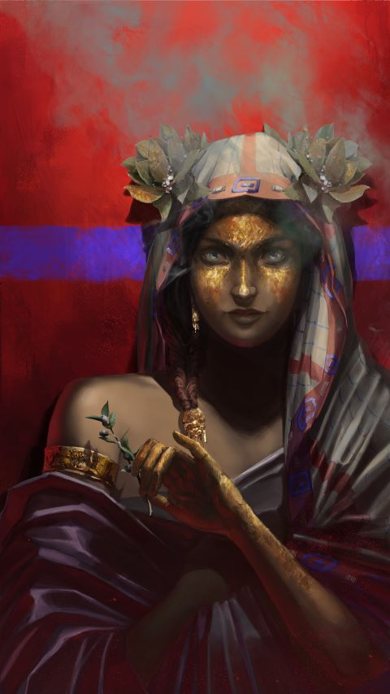

  

Clan : Malkavien
Génération : Septième
Sire : Dyonisia

# ═══════════════════ Attributs ═══════════════════
```
      Physiques                                Sociaux                                 Mentaux

Force     ⚪⚫⚫⚫⚫⚫⚫⚫⚫⚫  Charisme     ⚪⚪⚪⚫⚫⚫⚫⚫⚫⚫  Perception   ⚪⚪⚪⚫⚫⚫⚫⚫⚫⚫   
Dextérité ⚪⚪⚪⚫⚫⚫⚫⚫⚫⚫  Manipulation ⚪⚪⚪⚪⚪⚫⚫⚫⚫⚫  Intelligence ⚪⚫⚫⚫⚫⚫⚫⚫⚫⚫   
Vigueur   ⚪⚫⚫⚫⚫⚫⚫⚫⚫⚫  Apparence    ⚪⚪⚫⚫⚫⚫⚫⚫⚫⚫  Astuce       ⚪⚪⚪⚫⚫⚫⚫⚫⚫⚫   
```
# ═══════════════════ Capacités ═══════════════════
```
      Talents                                  Compétences                             Connaissances

Adresse      ⚫⚫⚫⚫⚫⚫⚫⚫⚫⚫  Animaux        ⚫⚫⚫⚫⚫⚫⚫⚫⚫⚫  Droit             ⚫⚫⚫⚫⚫⚫⚫⚫⚫⚫   
Athlétisme   ⚫⚫⚫⚫⚫⚫⚫⚫⚫⚫  Artisanats     ⚫⚫⚫⚫⚫⚫⚫⚫⚫⚫  Énigmes           ⚪⚪⚪⚪⚫⚫⚫⚫⚫⚫   
Bagarre      ⚫⚫⚫⚫⚫⚫⚫⚫⚫⚫  Commerce       ⚫⚫⚫⚫⚫⚫⚫⚫⚫⚫  Érudition         ⚪⚪⚫⚫⚫⚫⚫⚫⚫⚫  
Commandement ⚫⚫⚫⚫⚫⚫⚫⚫⚫⚫  Équitation     ⚫⚫⚫⚫⚫⚫⚫⚫⚫⚫  Investigation     ⚫⚫⚫⚫⚫⚫⚫⚫⚫⚫
Empathie     ⚫⚫⚫⚫⚫⚫⚫⚫⚫⚫  Étiquette      ⚪⚫⚫⚫⚫⚫⚫⚫⚫⚫  Médecine          ⚫⚫⚫⚫⚫⚫⚫⚫⚫⚫
Expression   ⚫⚫⚫⚫⚫⚫⚫⚫⚫⚫  Furtivité      ⚪⚫⚫⚫⚫⚫⚫⚫⚫⚫  Occultisme        ⚪⚪⚪⚫⚫⚫⚫⚫⚫⚫
Intimidation ⚫⚫⚫⚫⚫⚫⚫⚫⚫⚫  Mêlée          ⚫⚫⚫⚫⚫⚫⚫⚫⚫⚫  Politique         ⚫⚫⚫⚫⚫⚫⚫⚫⚫⚫
Intuition    ⚫⚫⚫⚫⚫⚫⚫⚫⚫⚫  Représentation ⚪⚪⚪⚫⚫⚫⚫⚫⚫⚫  Sagesse populaire ⚪⚫⚫⚫⚫⚫⚫⚫⚫⚫
Subterfuge   ⚫⚫⚫⚫⚫⚫⚫⚫⚫⚫  Survie         ⚫⚫⚫⚫⚫⚫⚫⚫⚫⚫  Sénéchal          ⚫⚫⚫⚫⚫⚫⚫⚫⚫⚫
Vigilance    ⚫⚫⚫⚫⚫⚫⚫⚫⚫⚫  Tir à l'arc    ⚫⚫⚫⚫⚫⚫⚫⚫⚫⚫  Théologie         ⚪⚪⚪⚫⚫⚫⚫⚫⚫⚫

```
# ═══════════════════ Avantages ═══════════════════
```
      Disciplines                               Historiques                             Vertus

Aliénation  ⚫⚫⚫⚫⚫⚫⚫⚫⚫⚫  Ressources ⚫⚫⚫⚫⚫⚫⚫⚫⚫⚫  Conscience      ⚪⚪⚫⚫⚫   
Auspex      ⚪⚪⚪⚪⚫⚫⚫⚫⚫⚫  Troupeau   ⚫⚫⚫⚫⚫⚫⚫⚫⚫⚫  Maîtrise de soi ⚪⚪⚪⚪⚪  
Occultation ⚪⚪⚫⚫⚫⚫⚫⚫⚫⚫  Génération ⚪⚪⚪⚫⚫⚫⚫⚫⚫⚫  Courage         ⚪⚪⚪⚫⚫
                                       Renomée    ⚪⚪⚫⚫⚫⚫⚫⚫⚫⚫
```
### Auspex

### Occultation

# ════════════════════ Autres ═════════════════════

### Voie
```
Humanité ⚪⚪⚪⚫⚫⚫⚫⚫⚫⚫ 
```
### Volonté
```
⚪⚪⚪⚫⚫⚫⚫⚫⚫⚫ 
⬛⬛⬛⬛⬛⬛⬛⬛⬛⬛
```
### Réserve de sang
max 20, 4/tour
```
⬜⬜⬜⬜⬜⬜⬜⬜⬜⬜
⬜⬜⬜⬜⬜⬜⬜⬜⬜⬜
```
### Santé 
```
Tout va bien :)     ⬜      
Contusion           ⬛
Blessure légère  -1 ⬛
Blessure moyenne -1 ⬛
Blessure grave   -2 ⬛
Handicap         -2 ⬛
Infirmité        -5 ⬛
Invalidité          ⬛
```

### Atouts et handicaps

**Guérison lente**

**Absence de reflet**

**Alphabetisé**

**Linguistique (Grec)**

**⚪⚪ Chanceux**

**⚪ Malchanceux**