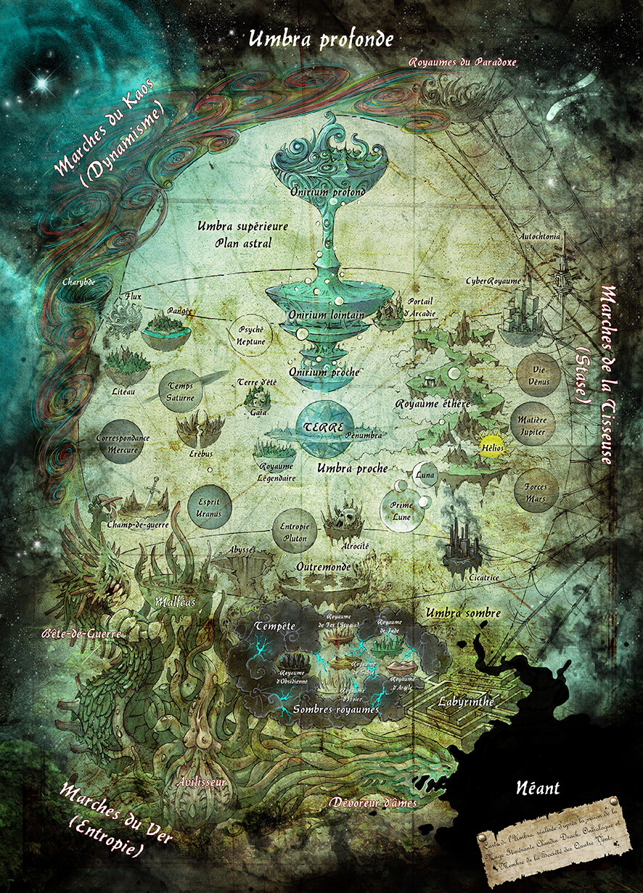

# Murmure du Crépuscule

Loup-Garou V20

**Race :** Lupus   **Auspice :** Ragabash   **Tribu :** Astrolâtre \
**Concept :** Bouffon

## Renommée
p.143-144 \
**Gloire :** 0,3 \
**Honneur :** 3,1 \
**Sagesse :** 0,3 \
**Rang :**  1 (p.251) \
**Expérience** (Totale/Restante) : 9/2 (p.244)
 
#
# Attributs
p.125
| Physiques | | Sociaux | | Mentaux | |
| --- | --- | --- | --- | --- | --- |
| Force | 1 | Charisme | 2 | Perception | 4 |
| Dextérité | 5 | Manipulation | 4 | Intelligence | 2 |
| Vigueur | *3* | Apparence | 2 | Astuce | 4 |
(dont +1 Vigueur par la Caladre)

# Capacités
p.127-131-133
| Talents ||  | Compétences || | Connaissances ||  |
| --- | --- | --- | --- | --- | --- | --- | --- | --- |
| Athéltisme | (Course d'endurance)| 3 | Animaux ||   | Droit ||   |
| Bagarre | (Arts martiaux) | 5 | Armes à feu ||   | Énigmes |(Choses que nul garou ne devrait savoir)| 4  |
| Commandement ||  | Artisanat ||   | Érudition ||   |
| Empathie ||  | Conduite ||   | Informatique ||   |
| Expérience de la rue ||  | Étiquette ||   | Investigation ||   |
| Expression ||  | Furtivité || 1  | Médecine || *1*  |
| Intimidation ||  | Larcin || 2  | Occultisme || 2  |
| Intuition primitive | (Pressentiments) | 4 | Mêlée ||   | Rituels | (Rituels mystiques)|  4 |
| Subterfuge || 1 | Représentation ||  1 | Sciences ||   |
| Vigilance | (Éclaireur) | 3 | Survie || 2 | Technologie ||   |
(dont +1 Médecine par la Caladre)

## Avantages & désavantages
* Voilé déchiré -3 (pas de Délire chez les humains)
* Proie d'un chasseur de loup-garou -3 (je l'ignore)
* Apprentissage rapide +3 (1 exp bonus)
* Pas de transformation partielle -1
* Vengeance -2 (Moloch)

| Historiques (p.136) | |
| --- | --- | 
| Rituels | 4 | page 202 |
| Vies ancestrales | 4 | 
| Esprit de la meute | 4 | 

**Rites connus** \
!8D10e[=10]c[>=6] # Rite d'invocation 2 (p.212 \
!6D10c[>=7] # Rite de purification 1 (p.205) \
!6D10c[>=6] # Rite de blessure 1 (p.217) \

## Dons :
(de race p.153 d'auspice p161 tribaux p.173) \
* Sentir la proie (p.159)
* Trouble de l'œil laiteux (p.161)
* Abattage (Mise au sol p.171)

### Rage (p.146) : 3/5
### Gnose (p.147) : 5/5
### Volonté (p.148) : 6/10

## Santé 
Contondants [/] Aggravés [X] Létaux [*] -- cf page 253

| Niveau | Malus | | |
| --- | --- | --- | --- |
| Contusions | |  |  | 
| Blessure légère | -1 |  |  | 
| Blessure moyenne | -1 |  | Vitesse de course divisée par 2 | 
| Blessure grave | -2 |  | Ne peut plus se déplacer et attaquer dans le même tour | 
| Handicap | -2 |  | Déplacement limité (tituber à ~3m/tour) | 
| Infirmité | -5 |  | Ramper ~1m/tour | 
| Invalidité |  |  |  Ne peut pas se déplacer, peut-être inconscient |
| Mort | | | | 

p.285
| | Homidé | Glabro | Crinos | Hispo | Lupus |
| --- | --- | --- | --- | --- | ---  |
| Diff. Transformation | 6 | 7 | 6 | 7 | 6 |
| Force | | +2 | +4 | +3 | +1 |
| Vigueur | |+2 | +3 | +3 | +2 |
| Dextérité | | | +1 |  +2 | +2 |
| Manipulation | | -2 | -3 | -3 | -3 |
| Apparence | | -1 |0 | | |
| Perception | | | | diff. -1 | diff. -2 |
| Autres | || DÉLIRE | Morsure +1 dégâts | | 

## Corps-à-corps
!1D10+9 # Initiative (p.266) DEX+AST +1D10 \
Actions supplémentaires p.288 \
Esquive : DEX + Athlétisme \
Bloquer : DEX + Bagarre \
Parer : DEX + Mêlée \
Dégâts (p.290) VIG + Armure diff 6 (contondants/aggravés) 8 (létaux)
| Arme | Difficulté | Dégâts | |
| --- | --- | --- | --- |
| Morsure | 5 | FOR +1 | Aggravés |
| Plaquage | 7 | Spécial  | Contondants | 
| Griffes | 6 |  FOR +2 | Aggravés |
| Agripper | 6 | FOR  | Contondants |  
| Coup de pied | 7  |  FOR +1 | Contondants |
| Coup de poing | 6 |  FOR  | Contondants | 

**Manœuvre de combat : La Pelade** (appris par la Caladre)
Un membre de la meute attaque (obligatoirement par griffe) afin de détruire l'armure d'un ennemi (qui perd 2 dés d'absorption)

#
## Récapitulatifs de combat pour DiceParser
!12D10c[>=6] # Esquive souple comme le vent

!12D10c[>=5] # Morsure brutale DEX + Bagarre

!10D10c[>=6] # Dégâts 

!5D10c[>=5] # Frénésie

!7D10c[>=8] # Abbatage 

!4D10c[>=6] # Vigueur

!4D10c[>=5] # Morsure brutale

!8D10c[>=7] # Trouver son chemin dans l'Umbra

!8D10c[>=6] # Discrétion 

!7D10c[>=4] # Perception  

!6D10e[=10]c[>=7] 

!8D10c[>=7] # Moon crystal power !

!1d10 # Étiquette

# Sessions 
| Session | Personnage | Race | Auspice | Tribu |
| --- | --- | --- | --- | --- |
| 1→ | **Murmure** du Crépuscule (Fujin) | Lupus | Ragabash | Astrolâtre |
| 1→ | **Agnès** Harsen | Métis | Ragabash | Furie |
| 1→ | **Alistair** MacNair | Homidé | Gaillard | Fionna |
| 1→ | Bois le sang de ses ennemis vaincus (**Drikk**let) | Lupus | Ahroun | Fils de Fenrir | 
| 1→ | **Harnie**  | Homidé | Ahroun | Rongeur |
| 1→ | **John** Carmack | Homidé | Théurge | Marcheur |
| 2→ | **Zip**actonal Tlayolotli | | | Enfant ||

## Backround

Allez hop, comme je n'ai pas envie de dormir présentation de mon perso :
Murmure du crépuscule est un lupus au pelage est gris pâle avec des reflets sombres, presque bleu nuit sur le dos et la queue. Il est plus petit et frêle qu'un garou normal mais compense par sa vivacité, qu'elle soit physique ou mentale. Comme tous les petits gabarits dans un monde de gros bourrins, il a la langue beaucoup trop pendue pour son propre bien Issu d'une longue lignée de sages, il partage volontiers cette expérience avec ses congénères.
Sous forme humaine, il se fait appeler Fujin (ça se prononce comme « Fou Djinn »). Sa tresse est très reconnaissable ; imaginez quelque chose comme [ça](../_images/fujin.png)

Le Dragon de Jade est dans la collection d'artefacts du sept vers la fin du XVIème siècle
Adrien Vauclair et Guy de Mennecy (famille pas loin de Fontainebleau)

La Frange : bar des 3,5 Louves (Agnès = 0,5 louve) sur l'île Saint-Louis

Tout a commencé six mois plus tôt, quelque part dans les steppes d'Asie Centrale. Galba Tisse-Ombre, le grand-père de Murmure a été tué et l'artefact qu'il protégeait (le Dragon de Jade) dérobé. Pas de piste nette, mais dans le Goulet planait la trace d'une présence maléfique : Moloch. 

Savant seulement qu'un dénommé Adrien Vauclair avait affronté cet esprit il y quelques siècles, Murmure s'est mis en route pour la France afin d'en savoir plus sur Moloch. À son arrivée à Paris, j'ai d'abord été accueilli par des Parents d'un membre de ma tribu qui ont un restau tibétain dans le 5ème arrondissement ( Aku, Jiara et leurs deux enfant) avant d'être aiguillé vers la Frange, « le bar des 3,5 louves » (Agnès compte comme 1/2 louve^^).

La piste de Guy de Mennecy (compagnon d'Adrien Vauclair qui rammena sa dépouille en France), s'arrête à Arbonne la Fôret (à côté de Fontainebleau). La piste s'arrête là pour l'instant. 

## Lundi 02/11
Rencontre des personnages

Voyage (Murmure + Alistair) en train jusqu'à la gare de Fontainebleau, où l'on retoruve John, Harnie et Drikk (Agnès est venue à moto). On finit dans l'entrepôt/squat d'Harnie à discuter. Puis on va à la chapelle d'Ury dans la forêt, où serait conservée une relique (vertèbre) de Saint Vauclair.
John passe dans l'Umbra afin d'en savoir plus pendant que l'on fait le guet (et qu'on empêche Harnie de pisser sur l'église)
Un homme se pointe au bout de 5 min (la cinquantaine, bérêt, tout ça), et dit que c'est qu'une légende locale... si ça se trouve il n'a jamais été enterré là et c'est juste une vertèbre de mouton.
John nous apprend qu'il y a un truc corrompu dans l'Umbra qu'il faut aller purifier.

En bas, on tombe sur l'homme au béret (suprise !) avec un peu moins de bras et un peu plus de tentacules.

Expérience : 0

## Dimanche 08/11
Affrontement contre l'homme au béret et ses deux esprits acolytes (sans Yehonn ni Gabriel...)

Alistair tente de l'enfermer dans sa cornemuse.
Harnie se fait contrôler mentalement et attaque Alistair (le mettant KO) puis Murmure (qui parvient à esquiver).
Agnès finit par dépenser toute sa Rage et perd sa forme Crinos.
Zip arrive au milieu du combat.
Finalement, M. Béret détruit le goulet par lequel nous étions venus et saute dans les Abysses avec le cercueil d'Adrien Vauclair

Note : Abysses = un des royaumes de l'Umbra, lieu sombre et maléfiques (dont nul ne revient jamais ?). Regarder dans les abysses fait peur

Soignés par Zip (qui a été envoyée pour nous suivre par Marie-Agnès de Vercour), nous arrivons à trouver un chemin de Lune (guidés par Murmure) et à quitter l'Umbra

Expérience : 4+1

## Dimanche 15/11
Ancienne meute : Vauclair, Mennecy et Oscar de Porchefontaine + une Arpenteuse (Suénazul)

Dragon de Jade offert par Mennecy&co aux ancêtres de Murmure.

Le petit vieux de la veille est André Malraux, le sacristain de la chapelle. On va chez lui (sauf Alistair et Arnie qui restent au squat) "discrètement" : Zip sonne, ce qui ameute deux doberman qui commencent à boulotter Agnès qui avait sauté par-dessus le mur de derrière. Résultat Drikk, Murmure viennent l'aider pour faire fuir les chiens. 

Zip discute avec une petite vieille voisine et se fait happer au scrabble. Drikk soulève le portail et enfonce la porte d'entrée. À l'étage, marque cheloue. Dans le miroir de la sdb Agnès voit un démon cornu qui danse. Dans le coffre du vieux, un incunable. Le démon le pique. On rameute la meute et on lance la chasse dans l'Umbra.

Morts de la peste noire ? John puis Zip ne se sentent pas bien. À un moment Harnie succombe à son instinct qui lui crie de s'enfuir (Frénésie), Zip et Agnès sur ses talons. 4 Élémentaires de peinture rouge nous mettent la misère, on les suit

Nous sommes dans le Royaume des atrocités (probablement qu'on a trouvé la tanière de Moloch)

Expérience : 3+1

## Dimanche 22/11
Fuite éperdue. On se retrouve dans le Royaume de la Cicatrice. On se fait repérer et pourchasser par la police local. Extraction à la Matrix pour revenir dans le monde réel en bord d'autoroute (nuit du 5 au 6 février)

John appelle Henri de Mennecy : il ne sait rien de ce journal ; peut-être caché dans le manoir (à vendre)
Visite du manoir (Zip/John/Alistair). D'autres acheteurs sont sur le coup et très proches de signer (coût 2,1 M€ ?)

## Dimanche 29/11
Expédition nocturne et discrète (tout le monde sauf John et Alistair). Harnie lève la piste d'un garou, s'amuse à l'énerver et il nous attaque. Avec sa meute. De Danseurs de la Spirale Noire.

Combat acharné. Harnie se fait lacérer (et prend mal aux fesses au passage quand un Crinos passe en frénésie). Zip et Murmure jouent à l'écureuil contre un tireur Glabro dans un arbre. Agnès se fait serrer (et broyer) par une grande femme. Murmure passe brièvement KO quand il se prend un chargeur dans la gueule, heureusement les renforts arrivent. Alistair découpe la fille qui était en train de broyer John (celui-ci a tenté de négocier sans grand succès) mais succombe à la frénésie et la dévore. La meute adverse finit par s'enfuir.

Ils étaient en train de creuser un tunnel pour s'introduire dans la maison. John propose de passer dans l'Umbra pour en savoir plus.

## Dimanche 6/12
Murmure sent la présence de gros garous qui s'enfuient de la maison. Au final on rentre panser nos plaies.

Vote pour le chef de meute :
- Harnie veut pas être chef et veut pas de chef non plus ! Par contre, il veut bien suivre les potes !
- John ne veut pas être chef. Il voit bien Drikkdet à cette position, ou un binôme Drikkdet/Alistair (ou Murmure)
- Zip trouve Drikkdet beaucoup trop violent, et préfère Alistair
- Agnès trouve Drikk trop phallocrate (et aussi un peu con), et préfère Alistair
- Murmure trouve qu'Alistair a cédé trop facilement à ses instincts, ce qui le disqualifie. Il se trouve un peu étranger et ignorant, donc il choisit Drikk
- Pour Drikkdet, Drikkdet est le meilleur choix : il est le plus fort, le plus intimidant, il est le seul de la meute à être de lignée...
- Alistair doit trancher... il hésitait à choisir Murmure, au final il vote Drikkdet.

→ Drikkdet devient le leader malgré l'opposition de Zip et Agnès

Pour le rituel de meute, on va devoir inviter une vingtaine de personnes. Personne n'est chaud pour faire ça dans le squat d'Harnie (surtout après un tour dans l'umbra : c'est mort de chez mort), donc on va faire un tour en forêt.

[Tour Denecourt](https://fr.wikipedia.org/wiki/Tour_Denecourt) ([photos](https://www.google.com/maps/uv?pb=!1s0x47e5f431771a9ec3%3A0xe401eef88c9dab92!3m1!7e115!4shttps%3A%2F%2Flh5.googleusercontent.com%2Fp%2FAF1QipNBXe6kdG34DI-EfgnPc61pjWfRVdeymQEZ9Ya3%3Dw260-h175-n-k-no!5spoint%20de%20vue%20foret%20de%20fontainebleau%20-%20Recherche%20Google!15sCgIgAQ&imagekey=!1e10!2sAF1QipMmVGUWZNGrMKAAYEd_lPTZC8Ck_VVzx3ET-k7t&hl=fr))
Dans l'Umbra : beaucoup d'esprits rapace y nichent. La forêt émet une faible lueur, dorée le jour, plus argentée la nuit (cela indique qu'elle mène probablement vers un monde féérique comme le portail d'Arcadie).

Le soir, la meute du Vieux Sang arrive (c'est Marie-Agnès qui dirigera le rituel). 

Autres invités : les Trois Louves, le Cac d'argent, les rats volants, les samouraïs et les sleipnir

Chasse avec le Vieux Sang : c'est Louise qui fait la traque chez aux (Murmure chez nous... Yehonn s'était endormi derrière son PC et on avait perdu Drikkdet). On ramène (en même temps \o/) un sanglier. 

Rituel : Drikk et Alistair se la pètent en Crinos, Agnès récupère le loup et se transforme aussi

La [Caladre](https://fr.wikipedia.org/wiki/Caladrius) est un suivant de la Licorne (totem des Enfants de Gaïa). C'est un totem de sagesse, de guérison et de vigueur.

Nom de la meute : **Les Veilleurs** (snif, ma proposition de *Sonneurs* en référence à notre première aventure n'a pas eu le succès que j'espérais)

Nous sommes le  9 février