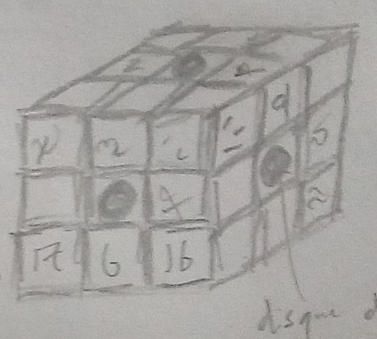

# Valery Falkov

### Aspects
- Ingénieur chirugien multifonctions
- À moitié borgé
- Ce n'est pas dans le manuel ? Il n'y a PAS de manuel !
- En vrai, c'est mon bateau
- Machinerie capricieuse mais inarrêtable 

| Approches ||
|---| --- |
| Astucieux | +2 |
| Flamboyant | +2 |
| ~~Puissant~~ Brutal | +3 |
| Rapide | +1 |
| ~~Soigneux~~ Prudent | +0  |
| Sournois | +1 |

### Prouesses 
- **Ça capitaine, je vous garantis que ça va marcher** \
BRUTAL, réussite avec style, explosion dramatique
- **Mécanique muscléee** \
Peut utiliser BRUTAL au lieu de PRUDENT pour utiliser des machines lourdes
- **Botte secrète nanite**
Une fois par adversaire, +2 en ASTUCIEUX pour une attaque

### Stress & Conséquence
[] [] []
- [2]
- [4]
- [6]

# Parties 

L'équipage de l'Entrée Fracassante :
- **Capitaine** Aston Sutton
- **Prince Aurèle** d'Arencourt
- Roberta, dite « **Bob** »
PNJ :
- Michel Mouche (mousse)

Nous sommes fortement endettés auprès de **Gustavo Vincento della Pieta del Real**

L'**Arsimboldo**, corvette des Oréades :
- Capitaine ??? (draguée par Aurèle)
- **Diego de Azur** (a esquinté l'œil du capitaine et s'est fait chourer sa cape par Bob)

Cube argenté, formé de 26 petits cubes gravés de symboles (style Rubik's Cube). Au centre de chaque face, pas de symbole mais un cristal kaléidoscope (disque transparent renvoyant une image déformée de ce qu'il y a de l'autre côté).

La **Sestrina**, navire marchand (propriété de Gustavo Vincento). Capitaine (âgé, jusqu'au boutiste) **Juan Carlo**.

On laisse l'équipage de la Sestrina avec notre navire dissimulé sur **Nessos IV** (planète discrète et froide)

Arrivée à la **Porta de Oro**.